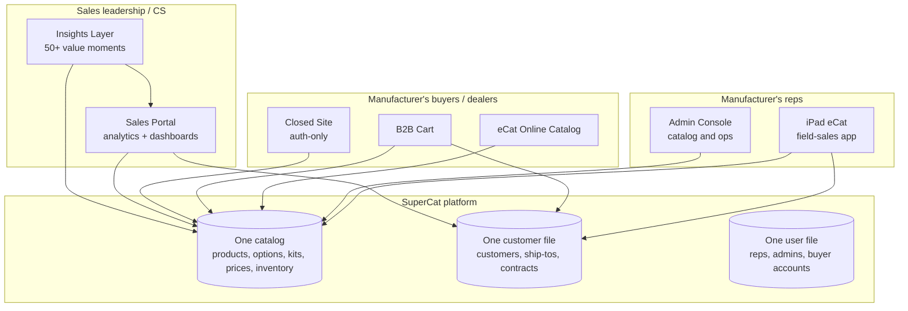

# 01 — What We Do

> **Last updated**: 2026-09-16 (persona surface-mapping cite moved to `personas/product/`. Previously: 2026-09-15 — replaced the 2026-08-27 **build once, do not condition on segment**
> rule with: one iPad-EC *shell*, job pack by selling motion; buyer jobs on eOL with fit that follows
> motion; HQ shared. Surfaces, gating layers, value moments and BCF unchanged. Prior version:
> `_archive/01_what_we_do_2026-09-15_pre-persona-groups.md`. Previously: 2026-08-27 added the now-withdrawn
> build-once rule. Prior: `_archive/01_what_we_do_2026-08-27_pre-persona-axis.md`. Previously: 2026-05-12)
> **Owner**: CEO
> **Review cadence**: Quarterly (or when product surface, gating model, or value-moment catalog changes)
> **Primary sources**: [`skills/insightful_product/01_bcf_instance_profile.md`](../skills/insightful_product/01_bcf_instance_profile.md), [`skills/insightful_product/04_value_moment_catalog.md`](../skills/insightful_product/04_value_moment_catalog.md), [`skills/monetization_refresh_2026/11_synthesis/2026-01-28__product_capability_map__m3_input__v1.md`](../skills/monetization_refresh_2026/11_synthesis/2026-01-28__product_capability_map__m3_input__v1.md)

---

## In one sentence

**SuperCat is the commercial operating system for furniture, lighting, and home-décor manufacturers — five connected surfaces (iPad field-sales app, online catalog, B2B cart, sales portal, admin console) that turn a manufacturer's catalog into orders across every channel they sell through.**

## Executive summary

- The product is **five surfaces, not five products**. They share one catalog, one customer file, one user file, one configuration model.
- **Most of the value comes from the iPad app and the buyer-facing surfaces.** The iPad app (88 of 118 active orgs) is the entry point; online catalog (48), B2B cart (26), closed site (43), and Sales Portal (32) compose around it as the customer matures.
- **CPQ — configurable products with option sets, mappings, riser pricing, and kits — is the only iPad capability with separate monetization today**, and it's our deepest vertical-specific capability. 18 of 118 orgs subscribe.
- **Gating works in five layers**: subscription plan → org flag → mobile-site flag → code-level allowlist → user-type permission. Layers 1–3 are the only ones operationally feasible for packaging.
- **What we do *for* customers is captured in 50+ value moments across 13 domains** — the canonical vocabulary for SuperCat's commercial value, validated against live customer data, and increasingly delivered as the **Insights Layer** (the product-form of the value-moment framework).
- The richest "as-deployed" reference instance is **Braxton Culler (BCF)** — full stack enabled, $6.5M GMV, 1,983 dealer customers, near-parity iPad/eOL channel mix.

---

## The five surfaces

Source: [`skills/monetization_refresh_2026/11_synthesis/2026-01-28__product_capability_map__m3_input__v1.md`](../skills/monetization_refresh_2026/11_synthesis/2026-01-28__product_capability_map__m3_input__v1.md) (code- and database-verified inventory, January 2026 capability audit, n=118 active orgs).

### Surface 1 — eCat iPad app
**Active orgs**: 88 of 118. **Base price**: $725/mo (25 included users, $20/user beyond).

The product's center of gravity. Manufacturer's reps walk into showrooms, dealer offices, and trade shows with a fully offline catalog: browse → configure → present → write → submit. Twelve core capabilities are universal in the base subscription (offline catalog, order creation, customer selection, smart stacks, library, sync, etc.). Twelve more are gated — some by org flag at no extra cost (camera scanning at 70% adoption, contract pricing at 32%, gridview ordering at 36%), some by paid add-on (CPQ, FlipBook, credit card capture).

### Surface 2 — eCat Online (eOL)
**Three sub-surfaces, three subscriptions:**

- **Online Catalog** — public buyer browsing. **$295/mo, 48 orgs**.
- **B2B Cart** — buyer self-serve ordering with checkout, configuration, kit support. **$295/mo, 26 orgs**.
- **Closed Site** — authenticated-only access; pairs with self-service enrollment. **$100/mo, 43 orgs**.

The buyer-facing layer. Same catalog the rep sees on iPad, exposed to dealers/buyers/designers as web. Configurable products and kits work in eOL too — a point the internal feature menu historically got wrong (the capability map confirmed it from code).

### Surface 3 — Sales Portal
**Subscription**: $395/mo. **32 orgs.**

Where sales leaders, managers, and the manufacturer's CS team live: dashboards, top products / customers / territories, sales graphs, customer/order/invoice management, reports with CSV/XLSX export. Embeddable on iPad via WebView so reps see their own analytics in-context.

### Surface 4 — Admin Console
**Included with iPad subscription** (no separate charge).

The manufacturer's back-office: catalog and taxonomy management, smart stacks, customers, orders, users, enrollment, library, reports, price levels, mobile sites, custom fields, notices, plus the configuration screens for every gated capability (option mappings, kits, contract prices, surcharges, distribution centers, RMA, payments, placements, commitments). Sixty-plus controllers; sixteen role-based admin permissions.

### Surface 5 — Data integration & platform
**Not user-facing, but commercially load-bearing.**

FTP data import (universal, default-on), order export to ERP (STD JSON v2), address verification (89 of 244 orgs use it on submitted orders), CDN/image hosting, external API access, customer-specific integrations like Bluelink (available-to-promise + freight/fuel). When a manufacturer says "you're our system of record for catalog and orders," this is the layer they're talking about.

---

## How it's gated (five layers)

From [`skills/monetization_refresh_2026/11_synthesis/2026-01-28__product_capability_map__m3_input__v1.md`](../skills/monetization_refresh_2026/11_synthesis/2026-01-28__product_capability_map__m3_input__v1.md):

| Layer | Mechanism | Who controls | Operationally feasible for packaging? |
|---|---|---|---|
| 1. Subscription plan | Billing record linking org → plan | SuperCat ops | Yes |
| 2. Org property/flag | Boolean or JSON property on org | SuperCat ops | Yes |
| 3. Mobile-site flag | Boolean or JSON property on mobile site | Customer admin or SuperCat | Yes |
| 4. Code-level feature allowlist | Hardcoded org/user lists in initializer | Engineering deployment | No |
| 5. UserType permission | Role-based matrix | Customer admin | No (within-surface granularity) |

Practical consequence: **only Layers 1–3 can be used for tier fences in the 2026 packaging refresh.** Everything else is either a deployment-time decision (Layer 4) or customer-internal (Layer 5).

The architecture is currently **modular, not tiered**. An org subscribes to iPad ($725), then separately adds Catalog ($295), Cart ($295), Portal ($395), Closed Site ($100), CPQ ($195 add-on or $795 bundle). The 2026 monetization refresh collapses this into T1/T2/T3 — see [`03_how_we_make_money.md`](03_how_we_make_money.md).

### Field and buyer jobs follow selling motion; HQ is the shared shell

*Corrected 2026-09-15. Replaces the 2026-08-27 rule that forbade conditioning product on segment.
See [`02_who_we_serve.md`](02_who_we_serve.md) § Persona groups.*

When we build for **field reps and buyers**, the job is a function of the client's selling motion
(roster lookup). A spec-rep's pre-appointment brief is not a volume-rep's catalog reference. A
showroom buyer's eOL is not a chain buyer's (and the chain buyer mostly will not use eOL).

When we build the **plumbing**, share it: one iPad-embedded web-component shell, one extract
pipeline, one eOL Cart, Portal/Admin for HQ. Parameterise HQ on structure and on the few jobs that
actually move with motion (account-decline window, merch grain). **Do not** ship four products. **Do
not** ship one job list for every motion.

There is **no incumbent rep analytics surface** — Territory Dashboard is enabled for **zero
organisations**. Field-rep analytics is greenfield and belongs in the iPad, because the unsolved
constraint is offline.

Detail: [`../personas/product/surface-mapping.md`](../personas/product/surface-mapping.md).

---

## What we do *for* customers — the value moments

Source: [`skills/insightful_product/04_value_moment_catalog.md`](../skills/insightful_product/04_value_moment_catalog.md) and [`skills/insightful_product/README.md`](../skills/insightful_product/README.md).

The product surfaces above are **what we ship**. The value moments below are **what customers get** — discrete, named insights and recommendations the platform produces. Each value moment has a defined signal, a worked customer example (validated against BCF), an action, customer value, and SuperCat value. **All are queryable today** (canonical count and domain list in `value_moment_catalog.md`).

| Domain | What it covers | VMs |
|---|---|---|
| **1. Rep Performance Intelligence** *(anchor)* | Behavioral scorecards, archetypes, funnel-gap coaching, non-selling-user role classification, seat utilization, rep engagement trajectory | VM-01 → VM-06 |
| **2. Instance Health & Configuration** | Catalog completeness, data freshness, import health, feature enablement gaps, configuration completeness | VM-07 → VM-11 |
| **3. Customer & Buyer Intelligence** | Customer activation rate, concentration risk, reorder velocity, enrollment funnel, buyer self-service adoption, dormant-customer segmentation, new-customer acquisition by channel & rep | VM-12 → VM-17, VM-41 |
| **4. Ordering & Commerce Analytics** | Order velocity, channel mix, AOV, order-type/workflow analysis, iPad behavioral feature usage | VM-18 → VM-22 |
| **5. Product & Inventory Intelligence** | Inventory × sales, product velocity, line analysis by category & collection, regional product intelligence, new-item performance | VM-37 → VM-40, VM-42 |
| **6. Cross-Instance Benchmarking** *(LIVE in BigQuery)* | Peer comparison, feature adoption benchmarking, growth trajectory, best-practice identification | VM-23 → VM-26 |
| **7. SuperCat-Internal Intelligence** | Composite account health score, expansion readiness, churn risk, support burden | VM-27 → VM-30 |
| **8. Portal & Demand-Side Intelligence** *(Clicky-powered)* | Portal traffic health, content performance, geographic demand map, visitor org identification, traffic source intelligence, portal engagement churn signal | VM-31 → VM-36 |

**The anchor is Domain 1.** Per-rep behavioral data tied to order outcomes, validated against the SuperCat selling correlation model (r > 0.96 for customer targeting). No competitor in the audit (see [`04_market_and_competitors.md`](04_market_and_competitors.md)) has this. The "find your Katrinka" insight — a rep with strong upstream targeting and discovery but weak configuration conversion, with a quantified coaching upside — is the killer worked example.

The value-moment framework is operationalized today through the **Insights Layer** product wedge. Reports are deliverable per-customer via Cursor operator prompts ([`skills/insightful_product/operators/`](../skills/insightful_product/operators/)) — open a chat, reference the operator file, type the customer name, get back both the customer-facing report and the internal CS brief.

---

## What it looks like deployed — Braxton Culler (BCF)

Source: [`skills/insightful_product/01_bcf_instance_profile.md`](../skills/insightful_product/01_bcf_instance_profile.md) (live MCP queries as of 2026-03-17).

BCF is the canonical reference customer — full stack, mid-size catalog, classic Platform-Embedded profile.

| Dimension | BCF |
|---|---|
| Active products | 3,427 |
| Catalog completeness | 82.4% |
| Customers loaded | 1,983 |
| Customers ordering (12mo) | 376 (19% activation) |
| Orders (12mo) | 2,556 |
| GMV (12mo) | ~$6.46M ($4.33M iPad + $2.14M eOL) |
| Channel mix | 51% iPad / 49% eOL |
| Org users | 1,370 total / 145 actively ordering (90d) |
| Portal invoices | 24,987 |
| Sales data rows | 15,950 |
| Kit items | 2,086 |
| Smart stacks | 124 |
| Composite health score | 0.75 / 1.0 (gap is missing Clicky portal) |

Five concrete lessons BCF teaches us about the product:

1. **The full stack is real and used.** iPad + Catalog + Cart + Portal + Closed Site + CPQ + Kits + Enrollment + FTP import + Sales data are all enabled. Channel mix near-parity (51/49). Heavy CPQ usage (7,173 configured-item adds in Mixpanel).
2. **A small number of reps drive most of the volume.** Of 49 active Q4 users, 10 are real sellers; 7 are non-selling roles (catalog managers, content/library managers, analytics users); 1,321 of 1,370 org users have never logged in.
3. **Behavioral coaching opportunities are quantified.** Katrinka Barnhart has the highest customer-targeting intensity of any rep but disproportionately low configuration activity — closing that gap to peer median = ~$8K/quarter incremental GMV per the validated correlation model.
4. **Dormant customers are the biggest activation lever.** 1,607 of 1,983 loaded customers have not ordered in 12 months. The top 10 at-risk high-value customers represent $347K in trailing-12mo GMV silent for 90+ days.
5. **Operational insights are tangible.** 9 of BCF's top 10 revenue products have zero available inventory — $500K+ in unfulfillable demand sitting in the data.

---

## Open intelligence questions

Things the foundation should be honest about not yet claiming:

- **Adoption numbers in this doc are from the January 2026 capability audit (n=118 active orgs).** Q425 customer-base readout uses ~110 accounts; the 2026-03-17 BCF cross-instance run shows segment counts of 86 Catalog-Focused / 15 Commerce-Active / 31 Platform-Embedded (= 132). Counts depend on the inclusion rule and date. None are wrong — but no single "as-of right now" number is canonical. Closing this needs an "as-of this quarter" one-row count of customers, mobile sites, and active orgs that the foundation set agrees on.
- **The product surfaces are documented; the user experience is not.** No screenshots, no flow diagrams from the buyer or rep perspective in this doc. A future v2 could pull worked screen captures from the operator-generated reports.
- **Integration depth varies by customer and is not catalogued at the foundation level.** ERP (STD JSON v2), Bluelink, address verification, custom CDN — present per-customer in the capability map, but not synthesized.
- **The split between "what's currently shipping" and "what's near-term roadmap" is not surfaced here.** Insights Layer is real and queryable; whether it's a packaged, sellable surface vs. an operator-driven CS deliverable is the open commercial decision (tracked in [`05_strategic_direction.md`](05_strategic_direction.md)).
