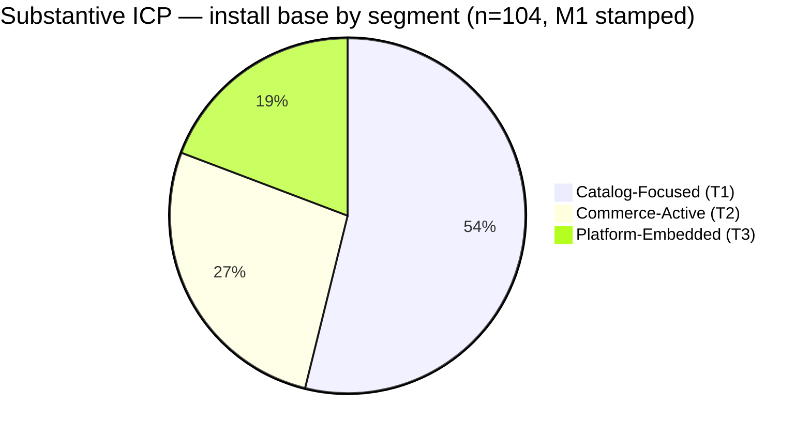

# 02 — Who We Serve

> **Last updated**: 2026-09-16 (persona cites moved to `personas/`. Previously: 2026-09-15 — **SuperCat personas = who consumes which product**; motion is a job pack on rep/buyer. Withdrawn the 2026-08-27 "build once, only 4 of 31 jobs vary, do not condition on segment" product rule. D-001a, Lens 1, the v4.0 roster and the four buyer roles unchanged. Lineage still holds: segments are stamped judgment, not first-touch-knowable. Prior version: `_archive/02_who_we_serve_2026-09-15_pre-persona-groups.md`. Previously: 2026-08-27 added the persona axis as 7 seats / 31 jobs plus the now-withdrawn build-once finding. Prior: `_archive/02_who_we_serve_2026-08-27_pre-persona-axis.md`. Previously: 2026-08-26, corrected the Lens 2 lineage claim — the v4.0 segments are stamped judgment corroborated by Postgres, not derived from it — and struck the "knowable at first-touch" claim, which was tested and is false; D-001a and T1/T2/T3 unchanged. Prior version: `_archive/02_who_we_serve_2026-08-26_pre-segmentation-lineage-correction.md`. Previously: 2026-07-09, added the market-selling-motion lens as a candidate ICP input)
> **Owner**: CEO
> **Review cadence**: Quarterly (or when segment definitions, install-base composition, or M1 stamped decisions change)
> **Primary sources**: [`skills/monetization_refresh_2026/11_synthesis/PRICING_CONSTITUTION.md`](../skills/monetization_refresh_2026/11_synthesis/PRICING_CONSTITUTION.md) D-001a (the **stamped, authoritative** segmentation — 2026-01-28), [`skills/monetization_refresh_2026/11_synthesis/2026-02-25__install_base_tier_mapping_wtp__d004a_exercise1__v1.md`](../skills/monetization_refresh_2026/11_synthesis/2026-02-25__install_base_tier_mapping_wtp__d004a_exercise1__v1.md) (segment → tier crosswalk), [`reports/state_of_industry/state_of_industry_benchmarks_2026-01-21.md`](../reports/state_of_industry/state_of_industry_benchmarks_2026-01-21.md) (market context), [`skills/insightful_product/01_bcf_instance_profile.md`](../skills/insightful_product/01_bcf_instance_profile.md) (deployed reference), [`Customer Segmentation/current/`](../Customer%20Segmentation/current/) (v4.0 client selling-motion segmentation, Kjael-stamped 2026-07-09 — a separate lens, see below)

---

## Executive summary

- **Who we serve is a behavioral posture, not a revenue band or a vertical.** The substantive segmentation work (stamped 2026-01-28 as decision D-001a in [`PRICING_CONSTITUTION.md`](../skills/monetization_refresh_2026/11_synthesis/PRICING_CONSTITUTION.md)) landed on **Digital Selling Maturity** as the primary axis. Revenue band, industry vertical, organizational scale, digital surface readiness, and tech sophistication were each evaluated against the install base data and **explicitly rejected**.
- **Three segments, behaviorally defined.** **Catalog-Focused** (54% of accounts, 35% of MRR — digitizing catalog and rep tools), **Commerce-Active** (27% / 34% — running digital ordering and self-serve buyer channels alongside field sales), **Platform-Embedded** (19% / 31% — SuperCat is core commerce infrastructure at scale). Each segment spans a wide range of company sizes and tenures.
- **Industry vertical is the *category* we play in, not how we segment customers.** Furniture, lighting, and home-décor manufacturers (with adjacencies in housewares and home & art) — but a $10M lighting catalog-only account and a $200M+ lighting full-stack account behave very differently and need very different things from us.
- **Revenue band was tested and rejected** because it correlates with stack but adds no independent information. Catalog-Focused includes both small emerging brands and large operationally sophisticated manufacturers (e.g., WAC/Modern Forms with 332K products, Visual Comfort Signature with 96K products) — "Catalog-Focused" describes their digital selling posture, not their business size.
- **The marketing-niche line we use externally** — *"mid-market furniture, lighting & home-décor manufacturers ($10–250M) selling through reps, dealers, showrooms, and designers"* — is a useful customer-facing simplification for outside-in messaging. **It is not the analytical basis for who we serve.** Treat it as the elevator pitch, not the segmentation.
- **The market context** is the wholesale home-furnishings universe — ~4,651 firms in the Jan 2026 TAM analysis (68% Furniture, 17% Lighting, 7% Home & Décor), 71% running the dealer + trade + (eCom) selling motion that the platform is built for. The TAM industry mix (68% Furniture) is **inverted from the current install base** (heavily Lighting in T1 and T3) — the segmentation generalizes across verticals; growth is not a vertical-specific question.
- **Our customers' customers** are four named buyer roles — designers, retailers, contractors/builders, and project-based commercial buyers — which the platform's surfaces (smart stacks, configurable products, contract pricing, closed-site portal, projects, RMA) are explicitly designed to serve.
- **A third, separate lens exists**: SuperCat also segments its ~109 client organizations by *how they sell to their own market* (Luxury Specification / Premium Trade Brand / Mid-Market Multi-Channel / Volume Distribution — stamped v4.0, Kjael, 2026-07-09). This is orthogonal to Digital Selling Maturity (it wasn't tested as part of D-001a) and is not yet load-tested for pricing/tiering — see the dedicated section below before treating it as an ICP axis.

---

## The substantive ICP — Digital Selling Maturity

Source: [`PRICING_CONSTITUTION.md`](../skills/monetization_refresh_2026/11_synthesis/PRICING_CONSTITUTION.md) D-001a (stamped 2026-01-28).

### Why this is the segmentation

> *"Customers and prospects are segmented by how digitally enabled their selling and commercial operation is — from digitized catalog and rep tools, through online ordering and self-serve, to fully integrated enterprise commerce. This axis is prospect-friendly (a company that has never heard of SuperCat can self-identify in seconds: 'Are you digitizing your catalog, or are you running digital commerce?'), non-judgmental (a $200M manufacturer with a mature dealer network and trade show program has low digital selling maturity — that's an accurate description of their digital commerce posture, not a statement about their business sophistication), and commercially meaningful (the segments predict product needs, willingness-to-pay, and expansion path)."*
>
> — D-001a, paraphrased

The axis maps directly to the three pricing tiers (T1 Catalog Essentials / T2 Commerce Professional / T3 Commerce Enterprise) — see [`03_how_we_make_money.md`](03_how_we_make_money.md). Behavior leads; pricing follows.

### Alternative axes that were evaluated and rejected

This is the structural reason the substantive ICP is *not* a revenue band or a vertical:

| Axis | Finding from install base data | Why rejected |
|---|---|---|
| **Revenue band** | Correlates with stack but adds no independent information | **Derivative, not causal** |
| **Industry vertical** (Lighting / Furniture / Home & Décor) | Similar MRR, usage, and stack profiles across verticals | Does not predict pricing behavior, product needs, or willingness-to-pay |
| **Organizational scale** (FIT sub-dimension) | Enterprise-scale companies have *lower* median MRR than small-scale (counterintuitive) | Does not map to commercial relationship |
| **Digital surface readiness** (FIT sub-dimension) | No correlation with MRR, stack adoption, or usage intensity | Non-differentiating |
| **Tech sophistication** (ERP/PIM presence) | 95 of 104 accounts have both ERP and PIM | Table stakes in vertical; completely non-differentiating |

**The one-line takeaway**: any framing that leads with revenue band, vertical, or company scale is segmenting on something that doesn't predict what these customers need from us, what they'll pay, or how they'll grow.

---

## The three segments

Source: [`PRICING_CONSTITUTION.md`](../skills/monetization_refresh_2026/11_synthesis/PRICING_CONSTITUTION.md) D-001a M1 (stamped 2026-01-28). Install base baseline n=104 accounts (master data v3).

### Segment 1 — Catalog-Focused

**Tier mapping**: T1 Catalog Essentials. **Digital selling maturity**: Early-stage.

> Digitizing product content, pricing, and field selling tools. Buyers can browse the online product catalog, but ordering is rep-led — digital commerce is handled through traditional channels or not yet activated.

| Profile | |
|---|---|
| Accounts | **56 (54% of base)** — the largest segment by count |
| Total MRR / share | $51,563 (35%) |
| Median MRR / Total ARR | **$778** / $618,756 |
| Industry mix | **Lighting 55%, Furniture 23%, Home & Décor 20%** |
| Median tenure | 3 years (2022 cohort); 30% pre-2018 (long-tenured iPad-only accounts) |
| Entity composition | 64% standalone, **36% rollup children** (highest rollup-child ratio of any segment) |
| Est. median employee count | ~37 |
| Est. median company revenue | ~$10M (**wide range — includes WAC/Modern Forms and Visual Comfort entities alongside small emerging brands**) |
| Usage (median) | 22K products, 20 active users, 24 orders/quarter, $153K GMV/quarter |
| Channel split | **100% iPad orders** (no eOL — they don't have online ordering modules) |
| Buyer activation (median) | 2 customers ordering / quarter out of 14.5K loaded |
| Value derived | $480 GMV per $1 MRR (annualized) |
| Variance | Single-user $366/mo accounts AND WAC (332K products, 83 users, 1,283 orders) — segment is defined by **what they use SuperCat for**, not by their scale |

**Representative accounts** (illustrating the wide scale range): WAC/Modern Forms ($1,842 MRR, 332K products), Visual Comfort Signature ($1,538 MRR, 96K products), Hooker Furnishings ($864 MRR, 37K products), Accord Lighting ($1,077 MRR, 6.9K products), Troy Lighting ($366 MRR — deeply discounted rollup child).

**Key insight**: Catalog-Focused is **not** "small companies." It is companies — at any scale — using SuperCat for catalog and rep tools, with dealers and traditional commerce channels handling the ordering motion outside the platform. The expansion path is T1 → T2: activate the Online Catalog gateway, demonstrate buyer engagement, then add B2B Cart and Order & Invoice Tracking.

### Segment 2 — Commerce-Active

**Tier mapping**: T2 Commerce Professional. **Digital selling maturity**: Mid-stage.

> Running digital ordering and/or self-serve buyer channels through SuperCat alongside field sales tools. Buyer self-service (order tracking, invoices) and operational workflow management are active needs — full sales analytics is an emerging aspiration addressed in T3.

| Profile | |
|---|---|
| Accounts | **28 (27% of base)** |
| Total MRR / share | $51,208 (34%) |
| Median MRR / Total ARR | **$1,822** / $614,499 |
| Industry mix | **Furniture 43%, Lighting 40%, Home & Décor 13%** (most balanced of any segment) |
| Median tenure | 7 years (2018 cohort); **53% pre-2018** — most tenured segment proportionally |
| Entity composition | 83% standalone, 17% rollup children (lowest rollup-child ratio — mostly independent operators) |
| Est. median employee count | ~44 |
| Est. median company revenue | ~$10M |
| Usage (median) | 26K products, 50 active users, 416 orders/quarter, **$1.3M GMV/quarter** |
| Channel split | **96% iPad / 4% eOL** — digital commerce emerging, iPad/rep-led still dominant |
| Buyer activation (median) | 34 customers ordering / quarter out of 42.5K loaded — **17× higher than Catalog-Focused** |
| Value derived | $852 GMV per $1 MRR. Segment generates $161M total GMV on $53K MRR |
| Stack diversity | 47% on iPad+Catalog+Portal (closest to T3 readiness), 33% on iPad+Catalog+Cart (T2-aligned), 20% on iPad+Catalog (T2 upgrade candidates) |

**Representative accounts**: Palecek ($3,251 MRR, 22.5K products, 2,733 Q4 orders — high-order-volume catalog-only), Hubbardton Forge ($3,025 MRR, 11.4K products, 1,580 orders, 185 users — Portal user), Crystorama ($2,540 MRR — above-book pricing with 100 provided users), Craftmade ($2,395 MRR — typical mid-tier), Sabine Pools ($580 MRR but 113K products — unusual profile).

**Key insight**: Commerce-Active accounts have the **strongest engagement intensity per dollar** in the install base — they live inside the platform daily, but ~67% are missing B2B Cart and ~53% are missing Order & Invoice Tracking. The intra-tier completion opportunity is large; the T2 → T3 path (analytics, dashboards, territory views) is the natural maturation.

### Segment 3 — Platform-Embedded

**Tier mapping**: T3 Commerce Enterprise. **Digital selling maturity**: Advanced.

> SuperCat is core commerce infrastructure — governing multi-channel ordering, buyer self-service, integrations, and operational analytics at scale.

| Profile | |
|---|---|
| Accounts | **20 (19% of base)** |
| Total MRR / share | $45,827 (31%) |
| Median MRR / Total ARR | **$2,173** / $549,926 |
| Industry mix | **Lighting 57%, Furniture 33%, Generic B2B 5%** |
| Median tenure | **8 years (2017 cohort); 57% pre-2018** — longest-tenured segment |
| Entity composition | 71% standalone, 29% rollup children |
| Est. median employee count | ~40 (note: enrichment estimates likely understate for several large accounts in this segment) |
| Usage (median) | 40K products, 136 active users, **2,327 orders/quarter**, **$8.2M GMV/quarter** |
| Channel split | **49% iPad / 51% eOL** — the only segment where digital self-serve has reached parity with rep-led |
| Buyer activation (median) | **208 customers ordering / quarter** out of 37.4K loaded — 104× higher than Catalog-Focused, 6× higher than Commerce-Active |
| Value derived | **$2,561 GMV per $1 MRR.** Segment generates **$768M total GMV on $47K MRR** — extraordinary value-to-price ratio |
| MRR clustering | P25–P75 is $2,022–$2,338 — remarkably narrow despite massive variance in usage and GMV (Summer Classics: $466M GMV; Kalco: 174 orders) — reflects legacy pricing compression, not equivalent value |

**Representative accounts**: Summer Classics Retail ($3,232 MRR — 20.7K Q4 orders, **$466.5M GMV** — highest in install base), Jamie Young Company ($2,950 MRR, 211 users), Wildwood/Chelsea House ($3,362 MRR — top MRR, above-book), Currey & Company ($2,173 MRR — median Platform-Embedded), Generation Brands (3 Visual Comfort instances under one parent).

**Key insight**: The **defining behavioral marker** of Platform-Embedded is the 49% / 51% iPad / eOL channel split — digital self-serve has reached parity with rep-led ordering. Switching cost is the highest in the install base; the real competitive risk is not platform replacement but a decision to build internally. The expansion lever is **services, premium support, and brand expansion**, not raw price correction (60% of this segment is already at or above book rate, the highest of any segment).

### Cross-segment summary

| Dimension | Catalog-Focused | Commerce-Active | Platform-Embedded |
|---|---|---|---|
| Accounts | 56 (54%) | 28 (27%) | 20 (19%) |
| Median MRR | $778 | $1,822 | $2,173 |
| Median orders / quarter | 24 | 416 | 2,327 |
| eOL order share | 0% | ~4% | ~51% |
| Buyer activation (median) | 2 | 34 | 208 |
| GMV per $1 MRR (median, ann.) | ~$480 | ~$852 | ~$2,561 |
| Total segment GMV (Q4) | ~$82M | ~$161M | ~$768M |
| Median tenure (cohort) | 2022 | 2018 | 2017 |
| Industry mix | 55% Lighting | 43% Furniture | 57% Lighting |
| Competitive alternatives | Highest | Moderate | Lowest |

### Segment ↔ commercial-tier crosswalk

Important wrinkle from [`skills/monetization_refresh_2026/11_synthesis/2026-02-25__install_base_tier_mapping_wtp__d004a_exercise1__v1.md`](../skills/monetization_refresh_2026/11_synthesis/2026-02-25__install_base_tier_mapping_wtp__d004a_exercise1__v1.md): M1 segments and commercial tiers do **not** map 1:1.

| | M1 Segment (behavioral) | Natural Tier (by module) | Delta |
|---|:---:|:---:|---|
| Catalog-Focused / T1 | 56 | 61 | +5 are modularly T1 but behaviorally Commerce-Active |
| Commerce-Active / T2 | 28 | 9 | **−19 are behaviorally T2 but modularly T1 or T3** |
| Platform-Embedded / T3 | 20 | 34 | +14 have Portal (T3 module) but were behaviorally classified as Commerce-Active |

**Why this matters commercially**: the ~19 accounts that are behaviorally Commerce-Active but modularly T1 are the **highest-conversion T1 → T2 upgrade targets** in the entire install base. They already behave like T2 customers — they just haven't bought T2 capabilities. Segments inform *how we talk to customers* (JTBD, value drivers, messaging); tiers inform *what they pay* (price points, included capacity, feature gates). Both lenses are kept on purpose — collapsing them would destroy this signal.

---

## A third lens: how our clients sell *in the market* (not how they use SuperCat)

Source: [`Customer Segmentation/current/`](../Customer%20Segmentation/current/) — stamped **v4.0**
(Kjael, 2026-07-09; supersedes v3.2, Kylor-stamped 2026-07-02). This is a **separate, orthogonal**
segmentation from D-001a above — **not a replacement, not a re-litigation, and not yet folded into
the stamped ICP.** It's added here because the propagation handoff for that work asked this doc to
reflect it as an input for any future ICP refresh.

**Important distinction:** D-001a's Digital Selling Maturity segments (Catalog-Focused /
Commerce-Active / Platform-Embedded) classify **how digitally mature a client's use of SuperCat
is.** The v4.0 client segmentation below classifies **how a client sells *its own products* to
*its own market*** — a question D-001a never tested (the axes it evaluated and rejected were
revenue band, industry vertical, organizational scale, digital surface readiness, and tech
sophistication — not selling motion). The two segmentations describe different things about the
same 100+ accounts and are expected to disagree in individual cases; that's not a conflict, it's
two different questions.

### The v4.0 client segmentation (109 SuperCat client organizations)

| # | Segment | Count | Selling motion |
|---|---------|-------|-----------------|
| 1 | Luxury Specification | 33 | Designers/architects specify the product into a project |
| 2 | Premium Trade Brand | 38 | Dealers carry the line on brand reputation |
| 3 | Mid-Market Multi-Channel | 24 | Trade + retail + online distribution, competing on breadth |
| 4 | Volume Distribution | 14 | Commodity distribution, high volume, low unit price |

*(These are Kjael's original stamped headline counts. Two rounds of post-stamp correction fixed
which org 2 specific rows pointed at (a Gabriella White / Summer Classics parent-family identity
mixup) without changing the totals — see
`Customer Segmentation/v4/v4.0_archive/unmatched_accounts_validation_2026-07-09.md`.)*

**What this lens is — corrected 2026-08-26.** The v4.0 client segmentation is a **stamped
selling-motion classification (Kjael, 2026-07-09), carried forward from v3.2 and corroborated
against first-party Postgres data. It is not computed from that data.** An authored rule over the
four fields most associated with it — average order value, price-code count, customer count, order
volume — reproduces the stamped label only **38.5% of the time against a 34.9% majority-class
baseline**, and thresholds fitted directly to the roster cap at **50%**. The Postgres enrichment was
run to *test* the v3.2 model and confirmed it; it did not generate it, and the stamped doc says so
itself (*"Used v3.2 validated segments as the null hypothesis"*, §1.3; *"price does NOT define this
segment"*, §4).

This does not weaken the lens — stamped judgment about observed selling behaviour is a legitimate
basis under [`07_how_we_establish_truth.md`](07_how_we_establish_truth.md) principle 7. It does mean:
**the authority is the roster lookup, keyed on org shortname, not a recomputation.** A new quarter of
order data does not re-segment anyone, and the four fields cannot be used to audit or overturn a
stamped label. Full derivation and per-segment thresholds:
[`sources/customer_segmentation/taxonomy/account-segments.md`](sources/customer_segmentation/taxonomy/account-segments.md).

Three enrichment axes ride alongside the four segments as **continuous dimensions, not sub-segments**:

- **What they sell** (product vertical: furniture, lighting, accessories, decor/art, outdoor, rugs,
  textiles) — does **not** segment cleanly; every vertical spans multiple segments (lighting alone
  spans all 4). This echoes D-001a's own finding that industry vertical doesn't predict behavior.
- **Who they sell to** (trade/designers, wholesale/dealers, wholesale/retailers, volume retail,
  broad network, mixed) — near-redundant with selling motion; it's predicted by the segment, not
  independent of it.
- **Median/best price** — a correlate within each segment, not a boundary. The Luxury
  Specification ↔ Premium Trade Brand overlap zone (~$300–$700) is exactly where price fails to
  separate segments and selling motion has to do the work.

### Why this matters here, and what it doesn't change

- **It does not change T1/T2/T3 pricing or the stamped D-001a decision.** Tiers still track
  digital-commerce behavior, not market selling motion.
- **It *does* change what we build for field reps and buyers.** *(corrected 2026-09-15)* Selling
  motion is the classifier of the *job*, not "vocabulary on screen." Spec-rep vs volume-rep, and
  designer/showroom vs chain replenishment, are different analytics jobs. HQ work is mostly shared
  and can be parameterised (decline window, merch grain, catalog scale). Do not cite the withdrawn
  "only 4 of 31 jobs vary / one surface serves everyone" finding as product doctrine.
  Detail: [`../personas/00-PERSONA-GROUPS.md`](../personas/00-PERSONA-GROUPS.md).
- **It's a candidate input for messaging, not for pre-sale qualification.** An earlier version of
  this doc asserted that a prospect's market selling motion is "knowable at first-touch, before any
  SuperCat usage data exists." **That has been tested and is false.** Two methods were tried against
  the public web: holistic reading of whole sites reaches roughly **53% against a 30% baseline**,
  and binary feature extraction reaches **33.3% against a 34.5% majority-class baseline (n=87)** —
  i.e. no better than guessing the largest segment. Public substitutes were searched for and do not
  exist: dealer locators are private per-brand APIs, sitemaps track web platform rather than
  business model, and the major marketplaces block scraping. State the limit precisely — **binary
  public feature extraction cannot predict a segment; holistic reading gets to roughly 53%; neither
  is good enough to label a prospect with a v4.0 segment.** Do not shorten this to "public data
  cannot predict segment": that overstates the finding and misdescribes what a person qualifying a
  prospect actually does. Pre-sale classification uses Prospect Archetypes
  ([`sources/customer_segmentation/taxonomy/prospect-archetypes.md`](sources/customer_segmentation/taxonomy/prospect-archetypes.md)),
  a separate layer whose correspondence to these segments is published rather than assumed — one
  archetype of four beats baseline, and its most useful property is **exclusion** (0 of 20
  trade-gated orgs are Mid-Market Multi-Channel) rather than assignment.
- **Open question, not yet answered**: whether market selling motion correlates with expansion
  path or willingness-to-pay independent of Digital Selling Maturity. This would need the same
  install-base rigor D-001a got (Phase 2 JTBD/WTP work) before it could justify changing pricing or
  tiering — it has not had that yet, and should not be treated as if it has.

---

## The marketing niche we use externally

> *Mid-market furniture, lighting & home-décor manufacturers ($10–250M) selling through reps, dealers, showrooms, and designers.*

This is the line we use on the website, in pitches, in outreach, and in first-call qualification. **It is a deliberately simplified outside-in framing** designed to let a prospect self-identify in seconds. It is not how we segment customers internally and it is not the analytical basis for product, pricing, or GTM decisions.

**Why it works as a marketing niche** — it's concrete, it's namable, it filters out obvious non-fits (pure DTC brands without dealer/trade channels, single-channel marketplace sellers, software/SaaS, services businesses, anything outside home furnishings).

**Why it's wrong as a segmentation framework**:

- **The revenue band ($10–250M) doesn't predict anything analytical.** Per the M1 data, segment membership is uncorrelated with company size — Catalog-Focused includes both single-user $366/mo accounts and WAC/Modern Forms (332K products); Platform-Embedded includes accounts likely well above the $250M ceiling.
- **The vertical naming ("furniture, lighting, home-décor") is the category, not the cut.** All three segments span all three named verticals; vertical mix shifts across segments (Catalog-Focused 55% Lighting, Commerce-Active 43% Furniture, Platform-Embedded 57% Lighting), confirming vertical doesn't drive behavior.
- **The four-channel taxonomy ("reps, dealers, showrooms, designers")** describes the customer's *selling motion* — useful for first-touch qualification, not for predicting tier-fit, expansion path, or willingness-to-pay.

**The right way to use this line**: outside-in marketing copy. **The wrong way**: as an internal target-customer definition that GTM, product, or strategy work hangs off of.

---

## The market we play in (context, not ICP)

Source: [`reports/state_of_industry/state_of_industry_benchmarks_2026-01-21.md`](../reports/state_of_industry/state_of_industry_benchmarks_2026-01-21.md). Jan 2026 TAM analysis of 4,651 wholesale firms in home-furnishings adjacencies.

### Industry composition

| Segment | Companies | Share |
|---|---:|---:|
| Furniture | 3,167 | 68.1% |
| Lighting | 793 | 17.1% |
| Other (mixed/unclassified) | 344 | 7.4% |
| Home & Décor / Housewares / Art Manufacturers | 314 | 6.8% |
| Retail / Multi-Brand Showrooms | 24 | 0.5% |
| Generic B2B Wholesale | 9 | 0.2% |

**Important inversion**: TAM is 68% Furniture / 17% Lighting. Current install base is **the opposite shape** — Catalog-Focused is 55% Lighting / 23% Furniture; Platform-Embedded is 57% Lighting / 33% Furniture. Per the M1 TAM perspective: *"the segmentation generalizes across verticals."* Growth into the Furniture-heavy TAM is not a different segmentation question; it's the same three behavioral segments applied to a different vertical mix.

### How they sell (route-to-market)

71.2% of the universe runs the **dealer + trade + (eCom or not)** motion. This is exactly the cut SuperCat is built for. The remaining ~29% are either DTC-only ecommerce plays or low-channel-breadth sellers — not the population we compete for.

### TAM digital readiness perspective

From the M1 TAM analysis: ~81% of the 4,651-firm universe has low-to-medium digital surface readiness (0–75) — natural Catalog-Focused and Commerce-Active prospects. ~19% have high digital readiness (76–100) — potential Commerce-Active or Platform-Embedded prospects. The behavioral segmentation maps cleanly onto the TAM.

### Catalog complexity

47.2% of TAM firms are <1K SKUs, 38.7% are 1K–5K, 11.4% are 5K–25K, 2.8% are 25K+. The bulk of the industry sits in the 1K–25K range — exactly where SuperCat's catalog architecture, configurable-products engine, and offline-iPad sync are most valuable.

### Trade-show intensity

~68% of the universe attends at least one trade show per year. The trade-show motion (write orders fast, offline, for hours, at scale) is one of SuperCat's strongest field-tested use cases.

---

## Our customers' customers — the four buyer roles

When a SuperCat rep selects a customer in the iPad app, they are selecting one of four named buyer types. The platform's surface design assumes a heterogeneous buyer-type mix in every customer file.

| Buyer role | What they need | How SuperCat shows up |
|---|---|---|
| **Designer** (interior, hospitality, contract, project specifier) | Sourcing curated selections for a specific client/project; needs visual catalogs, finishes/options, lead times | Smart stacks, PDF catalog generation, configurable products with option mappings, library/spec sheets |
| **Retailer** (furniture store, lighting showroom, dealer principal) | Restocking bestsellers; managing assortment for floor; placing routine reorders | Reorder workflows, customer-specific contract pricing, inventory visibility, B2B Cart for self-serve, portal for invoice/order tracking |
| **Contractor / Builder** (commercial, hospitality, multifamily) | Large project orders; specification compliance; backlog and ship-date predictability | Configurable products (CPQ for built-to-spec items), kits, address verification, ship-date and cancel-date controls, RMA |
| **Project-based commercial buyer** | Mixed: designer-led and retailer-mediated; needs flexibility, on-demand access | Closed-site authenticated portal, projects feature in eOL, enrollment workflows |

The validated SuperCat selling correlation model (analyzed across 7,000 reps over 2 years; see [Top Sales Activities Proven to Boost Revenue](https://thelinecard.com/top-sales-activities-proven-to-boost-revenue)) identifies six revenue-driving rep behaviors — Customer Targeting, Product Discovery, Configuration & Bundling, Presentation & Communication, Information & Planning, Engagement Depth. **Customer Targeting starts with knowing which of these four buyer roles you're selling to**, which is why every product surface is shaped around their differing needs.

---

## Persona groups — who consumes which product

> *Corrected 2026-09-15 evening. SuperCat personas are admin / VP / exec / sales rep / buyer.
> PG-01…08 are motion packs on rep and buyer, not eight extra people. D-001a, Lens 1, the v4.0
> roster, and the four commercial buyer roles above are unchanged.*

| Persona | Consumes | What to build for them |
|---|---|---|
| **Admin** | Admin Console | Catalog completeness, import alerts — not a sales dashboard |
| **VP of sales** | Sales Portal | Trust (EBR-91), team usage, account reconstruct, slipping accounts |
| **Executive** | Insightful | One invoiced topline. Suppress without a feed |
| **Sales rep** | iPad | Protect offline selling. Book analytics = **new iPad-embedded web component**, pack by motion |
| **Customer / dealer / buyer** ⚠️ | **eCat Online** | Reorder / specify / my price / my invoices. Fit: spec highest → volume never |

⚠️ *Our customer's customer.* Jobs only if they pay the manufacturer. **Do not fold** designer /
dealer / chain into one eOL bet.

**Seat facts that still hold**: ~4k iPad-active internals vs ~19k eOL-active buyers; almost no
overlap; a buyer cannot reach rep views; no incumbent rep analytics surface. Agency principal is
not servable this cycle.

*Depth: [`../personas/00-PERSONA-GROUPS.md`](../personas/00-PERSONA-GROUPS.md);
jobs [`../personas/analytics/jtbd-register.md`](../personas/analytics/jtbd-register.md);
surfaces [`../personas/product/surface-mapping.md`](../personas/product/surface-mapping.md).*

---

## A reference deployment — Braxton Culler

Source: [`skills/insightful_product/01_bcf_instance_profile.md`](../skills/insightful_product/01_bcf_instance_profile.md) (live MCP queries, 2026-03-17).

The single richest illustration of a fully-engaged Platform-Embedded account: **Braxton Culler** is a North Carolina–based furniture manufacturer running every surface SuperCat ships.

| Dimension | BCF |
|---|---|
| Behavioral segment | **Platform-Embedded (T3)** |
| Vertical | Furniture (the dominant TAM segment, the *minority* of Platform-Embedded by industry mix) |
| Geographic concentration | NC, NJ, FL, DE, SC = 51% of GMV |
| Catalog | 3,427 active products, 29 categories |
| Dealer footprint | 1,983 customers loaded; 376 ordered in trailing 12mo (19% activation) |
| Channel mix | 51% iPad / 49% eOL — textbook Platform-Embedded |
| Annual GMV through SuperCat | ~$6.46M |
| Active selling team | ~10 active sellers + ~7 non-selling roles out of 1,370 total org users |
| Active features | Full stack — iPad + eCat Online + B2B Cart + Closed Site + Sales Portal + CPQ + Kits + Enrollment + FTP import + Sales data |
| Composite health score | 0.75 / 1.0 (gap is missing Clicky portal analytics) |
| Peer standing in segment (n=33) | Above median on logins (+24%) and MRR (+35%); **below median on orders (–41%)** — the dormant-customer activation opportunity |

**Why BCF is a faithful reference**: not the largest account in the install base, but the most representative of a fully-engaged Platform-Embedded customer. They use almost everything we ship; they have a real dealer network with real activation gaps; their reps span the full archetype spectrum (deep-account specialist, curated discovery seller, volume relationship seller, precision closer); and the Insights Layer's worked examples for them — *9 of 10 top-revenue products are out of stock, $500K+ in unfulfillable demand sitting in the data; one rep has the highest customer-targeting intensity but disproportionately low configuration conversion, with a quantified $8K/quarter coaching upside* — are exactly the kind of value-moment story the Insights Layer is designed to tell every customer.

A wider set of named reference deployments by segment lives in the segment profiles above — WAC/Modern Forms and Visual Comfort Signature for Catalog-Focused-at-scale; Hubbardton Forge and Palecek for the Commerce-Active middle; Summer Classics and Currey & Company for Platform-Embedded.

---

## Open intelligence questions

The substantive M1 work explicitly carried forward three validation gaps and three lower-priority enrichment asks. They are not "TAM re-slicing" gaps — they are the JTBD / WTP / retention gaps the segmentation framework needs to be load-tested against.

### Carried forward from M1 (Phase 2 in progress)

| Gap | What's missing | Where addressed |
|---|---|---|
| **Jobs-to-be-Done validation** | The JTBD per segment (e.g., *"let buyers order without calling a rep"* for Commerce-Active) are hypothesized from usage data, not confirmed by customers | Phase 2 Workstream A — 10–15 structured JTBD interviews per segment (30–45 total) |
| **Value driver ranking validation** | Per-segment value driver rankings are inferred from behavior, not force-ranked by customers | Phase 2 Workstream A — MaxDiff survey (100+ responses) or direct ranking in interviews |
| **Retention & expansion history** | No historical MRR data to calculate actual NRR, churn, or expansion rates by segment | Phase 2 Workstream B (price point modeling) + Workstream C (operational readiness) — pull 12–24 months of MRR history from billing, calculate segment-level retention/expansion |

### Additional enrichment (lower priority)

| Gap | What's missing | Why it would matter |
|---|---|---|
| **Support burden by segment** | CS/support ticket volume and resolution time per account, segmented behaviorally | Cost-to-serve by segment; informs pricing/margin model |
| **Competitive loss analysis by segment** | Historical win/loss reasons from CRM, sliced by digital selling maturity | Per-segment competitive playbook, not just per-competitor (see [`04_market_and_competitors.md`](04_market_and_competitors.md)) |
| **Buyer journey mapping by segment** | Sales cycle length, stakeholder count, common objections per segment from Sales interviews | Segment-specific GTM motion design |

### Foundation-level gaps (introduced by this doc)

| Gap | What's missing | Why it would matter |
|---|---|---|
| **Buyer-role distribution within accounts** | We know the four buyer roles exist; we do not have a defensible mix (e.g., "60% retailer / 25% designer / 10% contractor / 5% commercial") across or within accounts | Could be partially answered by a customer-name classification pass through Postgres `customers` data across the install base |
| **Geographic distribution at the install-base level** | BCF's regional concentration (NC/NJ/FL/DE/SC) is documented; the same view aggregated across the 104 install-base accounts is not | Useful for trade-show planning, dealer-program design, territory math |
| **As-of-date discipline on customer counts** | Different sources cite 104 (master data v3, used in M1), 110 (Q425 readout, used in pricing exploration), 118 (capability map, used in product audit), 132 (cross-instance BigQuery, used in Insightful Product) — different inclusion rules, all internally valid | A single "as-of this quarter" customer-count source-of-truth would let every foundation doc agree |
