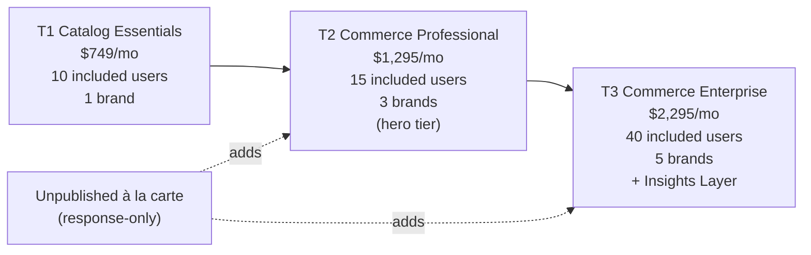

# 03 — How We Make Money

> **Last updated**: 2026-05-12
> **Owner**: CEO
> **Review cadence**: Quarterly (or when pricing constitution stamps a new decision)
> **Primary sources**: [`skills/monetization_refresh_2026/11_synthesis/PRICING_CONSTITUTION.md`](../skills/monetization_refresh_2026/11_synthesis/PRICING_CONSTITUTION.md) (stamped, authoritative), [`skills/monetization_refresh_2026/01_reference/MONETIZATION_REFERENCE.md`](../skills/monetization_refresh_2026/01_reference/MONETIZATION_REFERENCE.md), [`skills/monetization_refresh_2026/10_exec/2026-01-29__q425_customer_base_readout.md`](../skills/monetization_refresh_2026/10_exec/2026-01-29__q425_customer_base_readout.md), [`skills/fy26_target_scenario/SKILL.md`](../skills/fy26_target_scenario/SKILL.md)

> **Numbers discipline**: Where the constitution and a draft disagree, the constitution wins. All T1/T2/T3 prices, included users, expansion rates, and implementation fees in this doc cite the stamped decisions in [`PRICING_CONSTITUTION.md`](../skills/monetization_refresh_2026/11_synthesis/PRICING_CONSTITUTION.md).

---

## Executive summary

- **What we sell**: B2B SaaS subscriptions to the SuperCat platform — historically a five-product modular menu, transitioning in 2026 to **three Good/Better/Best tiers (T1 / T2 / T3)** with billable users as the primary value metric.
- **Today's book** (Q425, n=110 accounts): median MRR **$1,192.50**, median implied ARR **$16,123**, **89% monthly / 11% annual** contracts, MRR ranging from $366 to several thousand. Median catalog ~2,747 products; median quarterly orders 29.
- **What's changing in 2026**: The five-product menu collapses into three tiers — **T1 Catalog Essentials at $749/mo**, **T2 Commerce Professional at $1,295/mo** (the hero tier), **T3 Commerce Enterprise at $2,295/mo**. User expansion uses a step-declining curve ($25 → $22 → $20 → $18). Implementation moves to a tiered, data-readiness-based model. Sales Intelligence and the Insights Layer become the T3 differentiator.
- **The structural reason for the refresh**: Years of custom deals have created pricing inequity from **56% below book to 42% above book** for equivalent value. The refresh establishes a defensible price book and a migration plan to systematically correct legacy pricing.
- **Governance**: The CEO is the sole accountable decision authority for pricing. Decisions are stamped in [`PRICING_CONSTITUTION.md`](../skills/monetization_refresh_2026/11_synthesis/PRICING_CONSTITUTION.md) with a decision ID, date, and status. ACV is the primary success metric for the refresh; gross retention and win rate are watch-it-don't-instrument-it guardrails.

---

## How we earn today (the legacy economics)

Source: [`skills/monetization_refresh_2026/01_reference/MONETIZATION_REFERENCE.md`](../skills/monetization_refresh_2026/01_reference/MONETIZATION_REFERENCE.md), confirmed against [`skills/monetization_refresh_2026/11_synthesis/2026-01-28__product_capability_map__m3_input__v1.md`](../skills/monetization_refresh_2026/11_synthesis/2026-01-28__product_capability_map__m3_input__v1.md).

The current architecture is **modular, not tiered**. A customer subscribes to the iPad base, then stacks modules à la carte.

### Current rate card

| Product | Description | Base / mo | Per-user | Implementation |
|---|---|---:|---|---:|
| eCat iPad — Non-Configurable | B2B sales rep app (no CPQ) | $725 | 25 included; $20–25/mo per additional active user | $4,500 |
| eCat iPad — Configurable | iPad app + CPQ (option sets, mappings, riser pricing, kits) | $920 (or $725 + $195 CPQ) | Same as above | $6,500 |
| eCat Online — Product Catalog | Public buyer-facing catalog | $295 (book reference; some accounts at $395) | — | $2,500 |
| eCat Online — B2B Cart | Buyer self-serve ordering with checkout | $295 (book reference; some accounts at $395) | — | $1,250 |
| eCat Online — Sales Portal | Sales analytics, dashboards, BI | $395 | — | $2,250 |
| eCat Online — Closed Site | Authenticated-only access | $100 | — | — |
| Add-ons (CPQ, FlipBook, Credit Card, PCI, Image upgrade) | Discrete capability charges | $95 – $195 | — | — |

### What's monetized today

- **Primary**: Module selection (which of the five products are subscribed).
- **Secondary**: Active users on iPad products (25 included, $20–25/mo each beyond).
- **Services**: Upfront implementation fees per module ($1,250 – $6,500).
- **Premium options**: A small set of CPQ/credit-card/PCI/image add-ons.

### Q425 install base baseline

Source: [`skills/monetization_refresh_2026/10_exec/2026-01-29__q425_customer_base_readout.md`](../skills/monetization_refresh_2026/10_exec/2026-01-29__q425_customer_base_readout.md). Window: 2025-10-01 → 2025-12-31. n = 110 accounts (109 active, 1 inactive).

| Metric | p25 | Median | p75 | Mean |
|---|---:|---:|---:|---:|
| MRR (USD) | $725 | **$1,192.50** | $1,899 | $1,408.69 |
| Implied ARR (USD) | $9,425 | **$16,122.75** | $25,084.50 | $17,726.71 |
| Quarterly orders (Q425) | 1 | **29** | 330 | ~330 |
| Total products | ~1,108 | **~2,747** | ~5,538 | — |

**Channel mix (Q425)**: 36,249 total orders — **75.5% iPad / 24.5% eCat Online**.

**Contract cadence**: **89% monthly / 11% annual.** This is one of the most consequential structural facts about today's economics — it makes the book volatile and limits forecasting.

**Feature enablement (within the 110-account base)**:
- eOL Catalog: 53 (48.2%)
- eOL Cart: 32 (29.1%)
- eOL Portal: 35 (31.8%)
- Enrollment: 55 (50.0%)
- Online Library (mobile site): 45 (40.9%)
- Credit Card: 10 (9.1%)
- Address Validation: 4 (3.6%)

### Five problems the legacy economics create

Source: [`skills/monetization_refresh_2026/11_synthesis/PRICING_CONSTITUTION.md`](../skills/monetization_refresh_2026/11_synthesis/PRICING_CONSTITUTION.md), D-000a (stamped 2026-01-28).

1. **Per-user value metric is poorly executed.** The metric is right (value scales with selling teams), but the 25-user included base doesn't map to actual usage patterns, there's no volume incentive (the 26th user costs the same as the 200th), and arrears billing creates unpredictable customer bills.
2. **Per-module pricing has no expansion gravity.** Every module is $295–$395 with no tier logic, no bundle pricing, no aspirational upgrade path. Expansion is event-driven (customer needs a feature) rather than aspiration-driven (customer wants the next tier).
3. **Legacy pricing creates structural inequity.** Years of grandfathered rates and one-off discounts have spread the book from **56% below book to 42% above book** for equivalent value. This is not a handful of exceptions — it's the structural norm. Custom iPad bases as low as $350 (vs. $725 book), discounted user rates ($15–$22 vs. $25 book), bundled/free modules, and up to 100 provided users (vs. 25 standard).
4. **Implementation fees are front-loaded and disconnected from data readiness.** Fixed upfront fees regardless of whether the customer's data is pristine or requires extensive cleaning. Simple implementations subsidize complex ones; SuperCat likely undercharges data-heavy implementations.
5. **Support is unmonetized and uniform.** No tiered SLAs, no premium pathway. High-touch accounts consume disproportionate CS resources with no revenue offset.

---

## The 2026 model (T1 / T2 / T3)

All decisions below are **stamped** in [`PRICING_CONSTITUTION.md`](../skills/monetization_refresh_2026/11_synthesis/PRICING_CONSTITUTION.md) — each is identified by its decision ID (D-XXXX) and date.

### Tier architecture (D-003a, D-003b — stamped 2026-01-28)

**T1 — Catalog Essentials**: Rep-led selling + catalog publishing. Includes the eOL Online Product Catalog as the gateway to digital commerce, even for accounts that don't have it activated today.

**T2 — Commerce Professional** (the hero tier — middle tier wins, by design): Adds B2B Cart, Order & Invoice Tracking (buyer self-service), and the operational commerce stack on top of T1.

**T3 — Commerce Enterprise**: Adds Sales Intelligence (analytics, dashboards, territory views) and the **Insights Layer** — proactive cross-customer benchmarks, account health scoring, churn-risk indicators, expansion-readiness signals, monthly/quarterly executive QBRs. Source: [`skills/monetization_refresh_2026/01_reference/2026-01-30__insights_layer_definition__v1.md`](../skills/monetization_refresh_2026/01_reference/2026-01-30__insights_layer_definition__v1.md).

### Stamped price points (D-004a — stamped 2026-02-25)

| Tier | Platform fee | Included users | Included brands |
|---|---:|---:|---:|
| **T1 Catalog Essentials** | **$749/mo** | 10 | 1 |
| **T2 Commerce Professional** | **$1,295/mo** | 15 | 3 |
| **T3 Commerce Enterprise** | **$2,295/mo** | 40 | 5 |

Tier ratios: T2/T1 = 1.7×; T3/T2 = 1.8×; T3/T1 = 3.1× — squarely within the 1.5–2.5× best-practice band for G/B/B packaging.

### User expansion (D-004b — stamped 2026-02-25)

Step-declining per-user curve beyond the included base:

| Additional users beyond included | Per-user / mo |
|---|---:|
| 1–25 | $25 |
| 26–50 | $22 |
| 51–100 | $20 |
| 101+ | $18 |

The step-declining curve fixes Problem 1: the 26th user costs less than today's flat $25, the 200th costs meaningfully less, and the curve creates an explicit volume incentive.

### Per-brand expansion (D-004c — stamped 2026-02-25, revised v4/v5)

Additional brands beyond the included count are priced at the **natural-tier rate at 90% of book** (10% multi-brand discount): T1 $674, T2 $1,166, T3 $2,066. Per-brand included users (no pooling). Multi-brand pricing is **consolidation-only (Path B)** — applied reactively, not on the default migration path. Multi-org discount sunset at the account level.

### Unpublished à la carte premiums (D-004d — stamped 2026-02-25)

Response-only, never published on the rate card:

| Premium SKU | Price |
|---|---:|
| Commerce (CPQ + advanced configuration) | $795/mo |
| Sales Intelligence (T2 customers wanting the analytics layer without full T3) | $995/mo |
| Premium Support | $495/mo |

### Implementation (D-003d — stamped 2026-01-28, revised 2026-03-11)

Tiered by customer **data readiness**, not module count:

| Implementation tier | When it applies | Fee |
|---|---|---:|
| **Essentials** | Standard data, ready to import | **Included** in subscription |
| **Guided** | Moderate data prep / mapping required | **$2,500** |
| **Comprehensive** | Heavy data work, multiple sources, custom mapping | **$5,000** |

This fixes Problem 4: cost matches complexity; simple implementations no longer subsidize complex ones. **Integrations are excluded** from these fees and priced separately under D-003f.

### Data integration (D-003f — stamped 2026-03-11)

Three paths, three price points:

| Integration path | Description | Price |
|---|---|---:|
| **Self-Serve** | Customer-driven via FTP/templates | **Included** |
| **Certified Pipeline** | SuperCat-built standardized integration to common ERPs | **$2,500** one-time |
| **Managed** | Bespoke build with ongoing hosting | **$5,000 build + $300/mo hosting** |

A creditable **Data Assessment** ($1,500) helps customers decide which path they need.

### Annual vs. monthly (D-004e — stamped 2026-03-11)

**No annual discount.** Annual is the same rate as monthly — but with a committed term and simplified billing. The thesis: customers who want annual want it for procurement reasons, not pricing reasons; discounting annual would erode revenue without changing the choice.

### Discounting policy (D-004f — stamped 2026-03-11)

**Subscription discounting is rare and CEO-approved**: 10% maximum, 12-month maximum duration. The primary discount lever is **onboarding/services**, not subscription. This protects the integrity of the new price book and prevents drift back into legacy-style structural inequity.

---

## Where T2 sits competitively

Source: [`skills/monetization_refresh_2026/11_synthesis/2026-02-25__competitive_price_benchmarking__d004a_exercise2__v1.md`](../skills/monetization_refresh_2026/11_synthesis/2026-02-25__competitive_price_benchmarking__d004a_exercise2__v1.md). See [`04_market_and_competitors.md`](04_market_and_competitors.md) for the full picture.

| Tier | SuperCat | AmpTab equivalent | Pepperi equivalent | Notes |
|---|---:|---:|---:|---|
| T1 ($749) | $749/mo | AmpTab Starter $500/mo (sticker) / $917/mo (Y1 effective with $5K setup amortized) | Pepperi Pro $1,220/mo at 15 users | SuperCat sits in the competitive sweet spot |
| T2 ($1,295) | $1,295/mo | AmpTab Advanced $1,000/mo / $1,833/mo Y1 effective | Pepperi Corporate $3,450/mo at 25 users | SuperCat is the clear value play |
| T3 ($2,295) | $2,295/mo | AmpTab Pro $3,000/mo / $5,500/mo Y1 effective | Pepperi Ultimate $6,400+/mo | SuperCat is 23% below AmpTab Pro sticker, ~58% below Y1 effective |

Stripping out raw rate-card differences, **SuperCat's full-stack Y1 effective price is within 15% of AmpTab at every tier**.

---

## How the migration works

The 2026 refresh is not a flag-day repricing. The migration is **per-account, value-anchored, and timeline-bounded**, with the explicit goal of correcting legacy inequity without triggering involuntary churn.

The detail lives in [`skills/monetization_refresh_2026/07_migration/`](../skills/monetization_refresh_2026/07_migration/) and the staged revenue impact lives in [`skills/monetization_refresh_2026/03_data/`](../skills/monetization_refresh_2026/03_data/) (most recent: the v5 migration revenue model from April 2026).

### Five-account locked cohort

There is a **5-account locked-pricing / in-implementation cohort** with contracted "true ARR" not reflected in the Q425 baseline. These are exceptions in the migration plan, not part of the default motion.

### The success metric

**ACV (Average Contract Value)** is the primary success metric for the refresh (D-000b — stamped 2026-01-28). Two lightweight guardrails are watched but not formally instrumented:

- **Gross retention**: If accounts churn citing pricing, pause and reassess migration pacing.
- **Win rate**: If new-business close rates deteriorate, the issue is messaging or price calibration — not architecture.

These are check-engine lights, not KPIs.

---

## Forward picture

Source: [`skills/fy26_target_scenario/SKILL.md`](../skills/fy26_target_scenario/SKILL.md).

The FY26 target scenario lives in its own workstream and is the primary place for the 12-month target shape. The model takes the Q425 baseline + the migration plan + the new T1/T2/T3 economics and produces a defended forward number. Specifics — per-tier mix targets, expected ACV uplift, churn assumptions — are owned in that workstream and referenced (not re-stated) here. See [`05_strategic_direction.md`](05_strategic_direction.md) for the strategic framing of the FY26 bet.

---

## Open intelligence questions

Things this doc is honest about not yet claiming:

- **Per-tier mix target for the install base post-migration is not yet stated here.** The Q425 baseline distribution (T1 41 / T2 58 / T3 11 in the tier-fit fences) is descriptive, not the target. The FY26 target scenario should resolve this.
- **Expansion economics within tiers** (user growth curve, brand additions, premium add-on attach rates) are designed but not yet observed empirically post-migration. Real numbers will come from the first two quarters under the new model.
- **NRR / GRR baseline is not stated here.** The Q425 readout gives a snapshot; trended retention is owned elsewhere and should be a foundation-level number once the FY26 model is finalized.
- **Cost-to-serve by tier is not modeled.** Problem 5 (support cost-to-serve) is named but not quantified. A future pass should land a defensible per-tier gross margin estimate so pricing decisions can be evaluated against profitability, not just revenue.
- **Discount and grandfathering schedule for the migration** is in the migration workstream; the foundation set should reference (not re-state) it once the migration revenue model is locked.
- **The locked-pricing cohort details** (which 5 accounts, contracted terms, exception path) are deliberately not in this doc — they're an operational migration detail, not foundational context.
