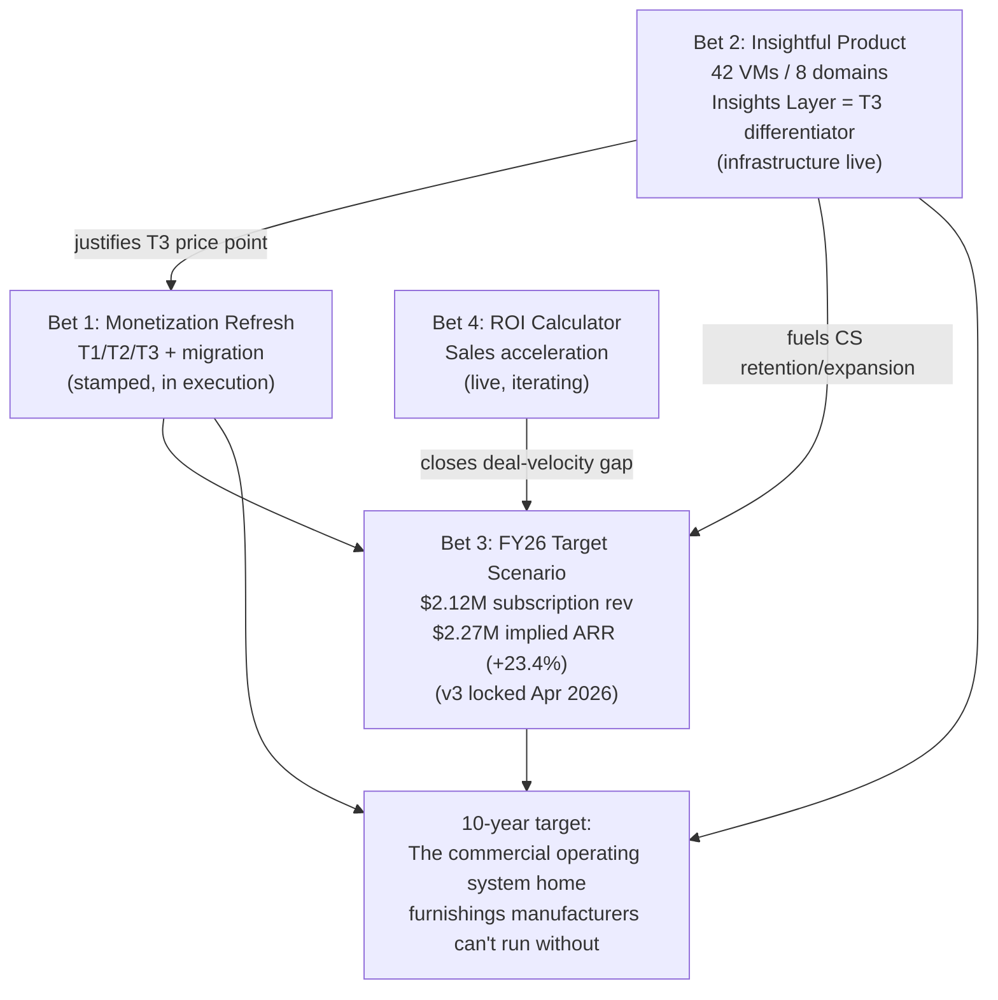

# 05 — Strategic Direction

> **Last updated**: 2026-05-12
> **Owner**: CEO
> **Review cadence**: Quarterly (or when a stamped strategic decision changes)
> **Primary sources**: [`skills/monetization_refresh_2026/10_exec/2026-01-28__executive_synthesis.md`](../skills/monetization_refresh_2026/10_exec/2026-01-28__executive_synthesis.md), [`skills/monetization_refresh_2026/11_synthesis/PRICING_CONSTITUTION.md`](../skills/monetization_refresh_2026/11_synthesis/PRICING_CONSTITUTION.md), [`skills/insightful_product/02_strategy_and_game_plan.md`](../skills/insightful_product/02_strategy_and_game_plan.md), [`skills/monetization_refresh_2026/01_reference/2026-01-30__insights_layer_definition__v1.md`](../skills/monetization_refresh_2026/01_reference/2026-01-30__insights_layer_definition__v1.md), [`skills/fy26_target_scenario/SKILL.md`](../skills/fy26_target_scenario/SKILL.md), [`skills/roi_calculator_90_day/SKILL.md`](../skills/roi_calculator_90_day/SKILL.md)

---

## The 10-year target

> **Be the commercial operating system home furnishings manufacturers can't run without.**

That target informs every active bet: each one either widens the moat around that position (depth in the ICP, indispensability of the platform), accelerates the path (commercial throughput, value capture), or closes a structural gap that would otherwise prevent us from reaching it (pricing inequity, undermonetized intelligence, weak deal-velocity tools).

## Executive summary

Four named bets define the 12–24 month strategic agenda:

1. **Monetization Refresh 2026** — Replace the modular five-product menu with stamped T1/T2/T3 packaging, fix structural pricing inequity (today's book ranges from 56% below to 42% above book for equivalent value), and install tier logic that gives expansion gravity. Status: stamped, in execution. Migration is the operational dimension.
2. **Insightful Product / Insights Layer** — Turn SuperCat's cross-customer data into a packaged, monetizable intelligence product. 50+ value moments across 13 domains, all queryable today. Cross-instance BigQuery infrastructure live. The defining T3 differentiator and the strongest competitive moat we have. Status: data infrastructure complete; commercial productization is the open decision.
3. **FY26 Target Scenario** — The quantified plan: **$2.12M subscription revenue** (+15.2% over FY25), **$2.27M implied ARR** (+23.4%), **year-end ACV $20,166** (+14.0%), **120 year-end accounts** (+13.2%). With churn suppression + floor pricing, implied ARR reaches **$2.41M (+31.1%)**. Status: v3 model locked April 15, 2026, with Q1 actuals integrated.
4. **ROI Calculator (90-day)** — Sales-enablement artifact that lets a prospect understand SuperCat's payback economics from their own customer count, AOV, and channel mix — without overclaiming. Closes the deal-velocity gap (the buyer-friction language pattern from [`04_market_and_competitors.md`](04_market_and_competitors.md): "time / bandwidth" was the #1 objection, 98 mentions across 43 companies). Status: live; iterative refinement.

> *Note: `skills/content_engine/` is a Skaling Ventures workstream, not a SuperCat bet — explicitly excluded from this list.*

---

## Bet 1: Monetization Refresh 2026

Source: [`skills/monetization_refresh_2026/`](../skills/monetization_refresh_2026/), with the canonical decision log in [`PRICING_CONSTITUTION.md`](../skills/monetization_refresh_2026/11_synthesis/PRICING_CONSTITUTION.md). Full economic detail in [`03_how_we_make_money.md`](03_how_we_make_money.md).

### The thesis

The 2026 refresh exists to solve **five structural problems** named in [`PRICING_CONSTITUTION.md`](../skills/monetization_refresh_2026/11_synthesis/PRICING_CONSTITUTION.md) D-000a (stamped 2026-01-28):

1. Per-user value metric is right but poorly executed (arbitrary 25-included base, no volume curve, arrears billing).
2. Per-module pricing has no expansion gravity — no tier logic, no bundle pricing, no aspirational upgrade path.
3. Years of custom deals have created structural pricing inequity (56% below book to 42% above book).
4. Implementation fees are front-loaded and disconnected from data readiness.
5. Support is unmonetized and uniform — no premium pathway, no cost-to-serve tiering.

### The shape

**T1 Catalog Essentials ($749/mo) → T2 Commerce Professional ($1,295/mo, hero tier) → T3 Commerce Enterprise ($2,295/mo)**, with billable users as the primary value metric on a step-declining curve ($25 → $22 → $20 → $18 per user beyond included), tiered implementation by data readiness (included / $2,500 / $5,000), and Sales Intelligence + the Insights Layer as the T3 differentiator.

### Why it's strategic, not tactical

Pricing changes the **commercial physics** of the business. The current modular pricing structure has the same revenue ceiling regardless of how good the product gets — modules cap value capture and discounting drives the realized rate below book. Tier logic with stamped pricing creates:
- **Expansion gravity** that the modular menu lacks (aspiration to grow into the next tier vs. event-driven module adds)
- **Defensible price discipline** (CEO-approved discounts, 10% max, 12-month max)
- **Per-customer ACV uplift** as the migration corrects legacy inequity over a defined timeline

ACV is the success metric for the refresh (D-000b — stamped). Gross retention and win rate are watch-it-don't-instrument-it guardrails.

### Status

Stamped, in execution. Migration plan is the operational dimension — per-account, value-anchored, timeline-bounded. The migration revenue model (v5, April 15, 2026) provides cohort-level deltas that feed the FY26 model.

---

## Bet 2: Insightful Product / Insights Layer

Source: [`skills/insightful_product/02_strategy_and_game_plan.md`](../skills/insightful_product/02_strategy_and_game_plan.md), [`skills/insightful_product/04_value_moment_catalog.md`](../skills/insightful_product/04_value_moment_catalog.md), [`skills/monetization_refresh_2026/01_reference/2026-01-30__insights_layer_definition__v1.md`](../skills/monetization_refresh_2026/01_reference/2026-01-30__insights_layer_definition__v1.md).

### The thesis

SuperCat's platform generates rich operational data as customers use it — product catalogs, ordering patterns, rep activity, buyer engagement, inventory states, integration health. **Almost none of that data is currently surfaced back to customers as actionable intelligence.** The Insights Layer turns it into a packaged, sellable capability.

The strategic claim: **only SuperCat can do this.** Cross-customer intelligence, behavioral pattern recognition, and anomaly detection at scale require access to data across the install base. No competitor in the audit has it. It's a moat the longer we sit on the data.

### The framework

**50+ value moments across 13 domains** (full catalog in [`01_what_we_do.md`](01_what_we_do.md)). Each VM is a discrete, named insight: signal, BCF-grounded example, action, customer value, SuperCat value. **All are queryable today.** Three layers:

1. **Instance Health & Configuration** — diagnostic insights about the customer's own SuperCat instance (catalog completeness, data freshness, import health, feature enablement gaps). Available to all tiers via Admin Console + CS artifacts.
2. **Operational Performance** — analytical insights about the customer's commerce performance (rep behavioral scorecards, customer activation/dormancy, channel mix evolution, AOV analysis, portal adoption). Sales Portal enhancement + Insights Layer module + CS artifacts.
3. **Strategic & Comparative Intelligence** — cross-customer intelligence, trend analysis, best-practice recommendations from cross-customer patterns. Insights Layer module (T3-exclusive) + CS strategic QBR materials.

### What's already built

- **Cross-instance BigQuery infrastructure** is **LIVE** (2026-03-24): 12 views, 3 tables, 2 scheduled monthly queries in `supercat-data-pipeline.insightful_product`. Always-current health scores, at-risk detection, expansion targeting. Segment classification (Catalog-Focused / Commerce-Active / Platform-Embedded) automated.
- **Query library** complete across MCP + Mixpanel + HelpScout + Clicky + Product/Inventory + Cross-Instance.
- **Operator prompts** in [`skills/insightful_product/operators/`](../skills/insightful_product/operators/) — open a Cursor chat, reference an operator file, type the customer name, get back both the customer-facing report and the internal CS brief. No SQL knowledge required.
- **Two report templates**: external (customer-facing QBR / monthly digest) and internal (CS / Sales account brief with health, churn risk, expansion readiness, support burden).
- **BCF as reference deployment** — 0.75 health score (gap is missing Clicky portal); concrete worked examples for every VM.

### What's open

- **Commercial productization**: Add-on module? Tier differentiator? The external report template defines the customer-facing content boundary; the internal template defines the operational boundary. The gap between them is the pricing boundary. The current direction (per [`PRICING_CONSTITUTION.md`](../skills/monetization_refresh_2026/11_synthesis/PRICING_CONSTITUTION.md) D-003e and the T3 narrative) is **bundled into T3**, with an unpublished à la carte SKU at $995/mo for T2 customers who want the analytics layer.
- **Delivery surface**: Sales Portal extension, Admin Console alerts, standalone Insights Layer module, or all three? Decision needed.
- **Three engineering asks** that close remaining capability gaps:
  1. Establish Clicky Analytics for BCF (raises BCF's health score 0.75 → 0.95+).
  2. Add `invoice_date` column to `sales_data` — unlocks time-series product trending (VM-38) for 81 orgs.
  3. Add `introduced_date` column to `products` — unlocks time-cohorted intro performance (VM-42 full version) for 164 orgs.

### Why it's strategic

**It is the T3 thesis.** Without the Insights Layer, T3 ($2,295/mo) is "T2 with bigger limits." With the Insights Layer, T3 is "the only platform that interprets your data for you." It's also the strongest competitive answer to WizCommerce's AI-first positioning (analytical intelligence vs. generative AI). And it materially de-risks retention by giving CS a permanent leading-indicator pipeline of churn risk and expansion readiness.

---

## Bet 3: FY26 Target Scenario

Source: [`skills/fy26_target_scenario/SKILL.md`](../skills/fy26_target_scenario/SKILL.md). v3 model locked April 15, 2026.

### The plan

| Metric | FY26 Target | vs FY25 |
|---|---|---|
| Subscription Revenue | **$2,120,139** | +15.2% |
| Implied ARR (6mo) | **$2,273,726** | +23.4% |
| New Booked ARR | $273,300 | +13.9% |
| Year-End MRR | $201,663 | +24.5% |
| Year-End Accounts | 120 | +13.2% |
| Year-End ACV | **$20,166** | +14.0% |

With **churn suppression + floor pricing**, implied ARR reaches **$2,414K (+31.1%)** — the upside scenario.

### How the plan composes

The v3 model uses a hybrid actuals + forecast architecture:

**Q1 2026** — Locked to scorecard actuals: Jan $163,771, Feb $168,207, Mar $152,464 (total $484,442). The March dip (NRR 90.64%) is seasonal user-fee reduction, not structural. End-of-Q1 account count: 109.

**Q2–Q4 2026** — Forecast from normalized Q1 average ($161,481/mo). Six waterfall components:

1. **Migration delta** — all 104 accounts in September: gross +$30,379/mo, churn −$11,748/mo, **net +$18,631/mo**.
2. **New logos** — 5/quarter at $1,125/mo MRR ($13.5K ACV).
3. **Tier upgrades** — 2× T1→T2 + 0.5× T2→T3 per quarter ($572/mo).
4. **Organic user expansion** — 2%/quarter on user-revenue portion (~22% of MRR).
5. **Background churn** — 0.53%/quarter (from 97.9% annual retention).
6. **Migration churn** — 4 accounts, $11,748/mo (additional to Q1 background churn).

### Why it's strategic, not just a forecast

The FY26 model is the **explicit linkage** between the monetization refresh (Bet 1), the new-logo cadence (sales motion), and the install-base economics. It quantifies the migration's value capture: **net +$18,631/mo from the migration alone** is the structural ACV uplift the refresh exists to produce. It also surfaces the operational tradeoffs — accelerating migration cohorts vs. deferring risky ones, the four migration-churn accounts to manage carefully, the new-logo cadence that has to hold.

The interactive Migration Schedule Explorer in the HTML artifact ([`reports/monetization_refresh_2026/fy26-target-scenario.html`](../reports/monetization_refresh_2026/fy26-target-scenario.html), deployed at [ceosystem.io/projects/fy26-target-scenario](https://ceosystem.io/projects/fy26-target-scenario)) lets the team and advisors stress-test cohort timing scenarios.

---

## Bet 4: ROI Calculator (90-day)

Source: [`skills/roi_calculator_90_day/SKILL.md`](../skills/roi_calculator_90_day/SKILL.md), live artifact at [`reports/roi_calculator_90_day/index.html`](../reports/roi_calculator_90_day/index.html).

### The thesis

Per [`04_market_and_competitors.md`](04_market_and_competitors.md), the #1 objection in our customer-facing call corpus is **"time / bandwidth"** (98 mentions across 43 companies). Price was 12 mentions across 10 companies. **Customers don't lose us because we're expensive — they lose us because the buying journey is too long and the payback is unclear.** The 90-day ROI calculator is the structural answer.

### What it is

A sales-ready calculator that lets a prospect input their own customer count, average orders, AOV, channel mix, and dormant-customer count — and see the payback math grounded in SuperCat's actual customer value drivers. Not a decorative tool; a financial argument wrapped in a product experience.

### Methodology principles (from the SKILL)

- Be skeptical of broad "% of revenue" drivers. They may be useful shorthand but are not enough to claim a first-principles model.
- Keep methodology visible. ROI calculators lose credibility when assumptions are hidden in a footer.
- Separate revenue growth from cost savings. CS deflection is valuable but is not incremental customer revenue.
- Prefer conservative defaults, explicit ranges, and "what would need to be true" framing over inflated hero numbers.
- Treat small-N customer anecdotes as calibration inputs, not public proof.
- Design for a skeptical operator or CFO — they should be able to interrogate the model without feeling manipulated.

### Why it's strategic

It does three things at once:

1. **Sales acceleration** — gives AEs a credible payback story without overclaiming.
2. **Marketing lead magnet** — instrumented, gated, deployed.
3. **Pricing pressure-test in the field** — every prospect interaction with the calculator is a free signal on whether T1/T2/T3 prices land at expected payback windows.

---

## How the four bets compose

The four bets are not parallel — they compose. The Insights Layer justifies the T3 price point in the refresh. The refresh produces the ACV lift modeled in FY26. The ROI calculator converts the prospect interest the refresh generates. The FY26 model is where all three meet a single number.

---

## What's deliberately not on this list

This doc lists **active bets**, not everything underway. Things in flight but not strategic-bet-grade:

- **CEO System** — operational rhythm, not a strategic bet. See [`06_how_we_operate.md`](06_how_we_operate.md).
- **Skaalyfam** — personal/family operating system, not a SuperCat workstream.
- **Sarreid iOS app** — separate product workstream, not a foundation-level bet.
- **State of Industry report** — research artifact that *informs* the bets above, not a bet itself.
- **`skills/content_engine/`** — Skaling Ventures workstream, not SuperCat. Explicitly excluded.

---

## Open intelligence questions

Things this doc is honest about not yet claiming:

- **The 24-month picture.** The four bets define a 12–24 month agenda; what comes after is not stated here. A v2 of this doc should articulate the 25–48 month bets (which are likely some combination of: international expansion, product-led-growth motion, partner channel, M&A or being acquired-into a larger platform).
- **Capital and runway are not stated.** Whether the FY26 plan is capital-constrained, fully funded from operations, or contingent on outside capital is a material strategic input that this doc does not address. Belongs in [`06_how_we_operate.md`](06_how_we_operate.md) v2 (Capital structure & runway gap).
- **Org / hiring plan to support the bets is not stated.** The four bets imply a specific shape of team — pricing/CS depth for the migration, data engineering for Insights Layer, sales leadership for new-logo cadence. Belongs in [`06_how_we_operate.md`](06_how_we_operate.md) v2 (Team & org structure gap).
- **Risk register.** The FY26 model surfaces specific risks (the 4 migration-churn accounts, new-logo cadence holding, March seasonal dip continuing). A foundation-level risk register that names the top 3–5 strategic risks and the watch-or-mitigate stance for each would strengthen this doc materially.
- **What we'd do differently if we ran the table on the bets.** Each bet has implicit success/failure criteria that are not surfaced here. A v2 should include the "if X bet underperforms in Q3, we do Y" planning that would actually make this doc the operational compass it could be.
