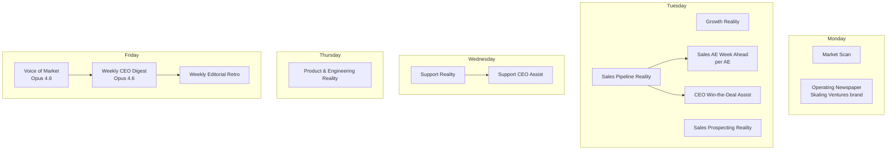

# 06 — How We Operate

> **Last updated**: 2026-05-12
> **Owner**: CEO
> **Review cadence**: Quarterly (or when CEO System architecture, data spine, or editorial protocol changes materially)
> **Primary sources**: [`Supercat_CEO_system_README.md`](../Supercat_CEO_system_README.md), [`skills/ceo_system/ARTIFACT_CATALOG.md`](../skills/ceo_system/ARTIFACT_CATALOG.md), [`skills/ceo_system/CEO_SYSTEM_GUARDRAILS.md`](../skills/ceo_system/CEO_SYSTEM_GUARDRAILS.md), [`.cursor/rules/ceo-editorial-feedback.mdc`](../.cursor/rules/ceo-editorial-feedback.mdc), [`QBO_Invoice_BigQuery_Dedup_Guide_README.md`](../QBO_Invoice_BigQuery_Dedup_Guide_README.md)

---

## Scope of this document (v1)

**This doc covers product + data spine + the CEO System operating cadence only.** It is deliberately scoped narrow.

It does **not** cover the human/organizational layer: team structure, reporting lines, financial close, hiring philosophy, governance, capital, or the customer-facing operating motions of sales/CS/support. Those are real and load-bearing — they are simply v2 work, called out explicitly in the **Gaps required to make this comprehensive** section at the end.

## Executive summary

- **One operating system, three layers.** A platform that ingests truth from the production product (Postgres MCP), the data warehouse (BigQuery), the call corpus (Fathom), the support corpus (Help Scout), and product instrumentation (Mixpanel, Clicky, Stripe, QuickBooks, HubSpot). On top of that data spine, an autonomous **CEO System** generates 13 weekly executive artifacts. On top of those artifacts, an **editorial feedback protocol** turns operator critique into runtime memory the next pipeline run incorporates.
- **The CEO System is the primary operating cadence.** Mon–Fri at 6:00 AM, 13 scheduled artifacts produce themselves: market scan and operating newspaper Mon; growth, sales pipeline, sales prospecting, sales AE week-ahead (per AE), and CEO win-the-deal assist Tue; support reality and support CEO assist Wed; product & engineering reality Thu; voice of market, weekly CEO digest, and weekly editorial retro Fri. All deploy to [ceosystem.io](https://ceosystem.io) via Vercel.
- **Two models, on purpose.** Voice of Market and Weekly CEO Digest run on **Opus 4.6** (synthesis-heavy). Everything else runs on **Sonnet 4.6**. Model selection and retry policy live in [`skills/ceo_system/orchestrator/config.yaml`](../skills/ceo_system/orchestrator/config.yaml).
- **Editorial memory is the closed-loop mechanism.** Feedback on any artifact is recorded via `editorial_memory record` and injected as a runtime preamble into the next pipeline run for that artifact. This is how the system gets better without re-prompting.
- **Discipline that is non-negotiable**: never query `quickbooks__invoice` raw with `WHERE balance > 0` (always wrap in the dedup CTE — raw queries can overstate AR by 5–7×); never edit a published artifact inline as feedback (always record via the editorial memory protocol); never hardcode hex colors in renderers (use brand-token CSS variables).

---

## The data spine

SuperCat's operating system runs on the truth in these systems. Each has a defined access path and a defined consumer set.

| Source | What it holds | How it's accessed | Primary consumers |
|---|---|---|---|
| **Production Postgres** (per-org instances) | Live customer state — products, orders, customers, inventory, users, configuration flags, portal data, enrollment, sales data | `supercat-postgres` MCP server (read-only) | Insightful Product, ad-hoc operator prompts, Weekly CEO Digest |
| **BigQuery** (`supercat-data-pipeline`) | Warehouse — datasets for `hubspot`, `Fathom`, `helpscout`, `stripe`, `quickbooks`, `mixpanel`, `clicky_analytics`, `linkedin_ads`, `facebook_ads`, plus the **`insightful_product`** cross-instance views (12 views, 3 tables, 2 scheduled monthly queries) | `bigquery-windmill` MCP for queries; `bigquery` MCP for schema/DDL | Every CEO System artifact; FY26 model; Insightful Product cross-instance |
| **Fathom** (call transcripts) | AI summaries + raw transcripts of customer-facing meetings | BigQuery tables `Fathom.ai-summaries` and `Fathom.call-transcripts` | Voice of Market (primary, two-pass full-transcript architecture), Weekly CEO Digest (citation), state-of-industry Section 2 evidence |
| **Help Scout** (support tickets) | Conversations + customers, synced to BigQuery via Airbyte | BigQuery `helpscout.*` tables | Support Reality, Support CEO Assist |
| **Mixpanel** (product instrumentation) | Per-user behavioral events (38 named counters) | BigQuery `user_feature_usage_report` view (fully operational since 2026-03-19) | Insightful Product Domain 1 (rep behavioral intelligence), Product & Engineering Reality |
| **Stripe** (subscription billing) | Subscriptions, invoices, payment status | BigQuery `stripe.*` tables | Insightful Product internal report (billing health), CEO System digest |
| **QuickBooks** (AR / accounting) | Invoices, balances, payments, accounting truth | BigQuery `quickbooks.*` tables — **always with the dedup CTE** ([`QBO_Invoice_BigQuery_Dedup_Guide_README.md`](../QBO_Invoice_BigQuery_Dedup_Guide_README.md)) | Sales Pipeline Reality, Weekly CEO Digest |
| **HubSpot** (CRM) | Deals, engagements, contacts, companies | BigQuery `hubspot.*` tables | Sales Pipeline Reality, Sales Prospecting Reality, Growth Reality |
| **Clicky Analytics** (portal traffic) | Visitor metrics, geographic, traffic source, organization identification for eCat Online portals | BigQuery `clicky_analytics.*` tables | Insightful Product Domain 8 (portal & demand-side intelligence) |

### Critical dedup discipline (QuickBooks)

The single most consequential data-truth rule in the operating system:

> **Never query `quickbooks__invoice` raw with `WHERE balance > 0`.** Always wrap in the dedup CTE that takes the latest row per `doc_number` ordered by `meta_data_last_updated_time`. Raw queries can overstate AR by 5–7×.

The dedup pattern is documented in [`QBO_Invoice_BigQuery_Dedup_Guide_README.md`](../QBO_Invoice_BigQuery_Dedup_Guide_README.md) and codified in [`.cursor/rules/qbo-invoice-dedup.mdc`](../.cursor/rules/qbo-invoice-dedup.mdc), which auto-attaches when an agent edits any BigQuery prompt or QBO file.

### Customer name resolution

Help Scout's `customers.organization` field does not match SuperCat shortnames cleanly. Before classifying calls, joining ticket data, or matching customer names across systems, resolve via [`skills/ceo_system/artifacts/customer_org_shortnames.csv`](../skills/ceo_system/artifacts/customer_org_shortnames.csv). See [`skills/ceo_system/artifacts/ORG_SHORTNAMES_README.md`](../skills/ceo_system/artifacts/ORG_SHORTNAMES_README.md) for the lookup process.

---

## The CEO System — autonomous weekly cadence

Source: [`Supercat_CEO_system_README.md`](../Supercat_CEO_system_README.md) and [`skills/ceo_system/ARTIFACT_CATALOG.md`](../skills/ceo_system/ARTIFACT_CATALOG.md) (canonical inventory).

### How the cadence runs

13 scheduled artifacts run Mon–Fri at 6:00 AM via macOS `launchd`. Schedule, model selection, retry policy, and agent-loop guardrails live in [`skills/ceo_system/orchestrator/config.yaml`](../skills/ceo_system/orchestrator/config.yaml). The full inventory (prompt → output → renderer → brand) is the single canonical table in [`skills/ceo_system/ARTIFACT_CATALOG.md`](../skills/ceo_system/ARTIFACT_CATALOG.md). This doc does not duplicate it; it points to it.

### Per-artifact pipeline

Every scheduled artifact follows the same 7-step pipeline:

1. **Read** prompt (`skills/ceo_system/prompts/<name>.md`).
2. **Agent loop** — Claude API with tool_use (BigQuery queries, file reads, custom pipeline tools).
3. **Write** markdown → `reports/ceo_system/<name>_<date>.md`.
4. **Render** HTML → `skills/ceo_system/<name>/scripts/render_html_wholesale.py`.
5. **Validate** HTML (>5KB, no `PLACEHOLDER_` tokens, no excessive `MISSING DATA`).
6. **Deploy** → `scripts/deploy_to_ceosystem.sh` (git push to ceosystem repo → Vercel auto-deploy).
7. **Slack notify** (success + ceosystem.io link, or failure + error).

### Two brands, on purpose

12 of 13 artifacts use the **SuperCat** brand (dark theme, Geist + crimson/gold; spec in [`skills/ceo_system/brand/supercat_design_system_v2.md`](../skills/ceo_system/brand/supercat_design_system_v2.md)). The Operating Newspaper uses the **Skaling Ventures** brand (newspaper aesthetic, DM Serif Display, Nevada copper; spec in [`skills/ceo_system/brand/skaling_ventures_design_tokens.md`](../skills/ceo_system/brand/skaling_ventures_design_tokens.md)).

Brand discipline is auto-enforced by the [`brand-tokens.mdc`](../.cursor/rules/brand-tokens.mdc) rule which auto-attaches when an agent edits HTML, render scripts, or brand specs. Hardcoded hex colors are forbidden — use `var(--sc-*)` or `var(--sv-*)`.

### Why two models (Opus vs Sonnet)

Voice of Market and Weekly CEO Digest run on **Opus 4.6** because they are synthesis-heavy:

- **Voice of Market** uses a two-pass transcript architecture that reads full untruncated call transcripts for the 5 highest-signal buyer/customer conversations each week. Synthesis quality matters more than throughput.
- **Weekly CEO Digest** synthesizes across every other artifact's output — pipeline, prospecting, support, product/eng, market, growth, voice of market — into a single executive narrative.

The other 11 artifacts run on **Sonnet 4.6** — analytical, structured, faster, cheaper, and well-suited to the per-domain reality reports.

### On-demand artifacts

Beyond the 13 scheduled, 8 on-demand artifacts ([`skills/ceo_system/ARTIFACT_CATALOG.md`](../skills/ceo_system/ARTIFACT_CATALOG.md)) cover specific operator situations: Daily CEO Delta, Market Facing Scan, Success QBR Generation, Success Key Account Brief, Success Instance Review, Onboarding Support, Product Walkthrough, Support Escalation. Same 7-step pipeline, invoked manually.

---

## Editorial feedback protocol — closing the loop

Source: [`.cursor/rules/ceo-editorial-feedback.mdc`](../.cursor/rules/ceo-editorial-feedback.mdc) (always-applied workspace rule).

The CEO System would be brittle if every prompt change required engineering involvement. The editorial memory layer is the structural answer.

### The protocol

When the CEO has feedback on any published artifact (newspaper, voice of market, sales pipeline reality, weekly digest, etc.):

1. **Recognize the artifact** — every published file maps to a named artifact (e.g., `voice_of_market`, `operating_newspaper`, `weekly_CEO_digest`).
2. **Classify the feedback** as one of three layers:
   - **Editorial memory** — runtime nudge (cross-run context, tone drift, temporary weight shift).
   - **Prompt change** — permanent design flaw the model will repeat regardless of memory.
   - **Pipeline / data fix** — missing or broken inputs the model can't fix because it never receives them.
3. **Record** via `python3 -m skills.ceo_system.orchestrator.editorial_memory record "<artifact_name>" "<feedback>" --tags <tags>`.
4. **Inject** — the next pipeline run reads the recorded feedback as a runtime preamble.
5. **Resolve** — when the issue is fixed, mark it resolved.

### Why this matters operationally

Without this protocol, every feedback iteration would either (a) require an engineer to edit a prompt, or (b) get lost. With it, the system has memory of what the operator wants and the operator has a stable feedback channel. **The cost of operator critique drops to a single command.**

The protocol is enforced by an always-applied workspace rule, which means any agent (Cursor, SDK, cloud) operating in this workspace is reminded of it on every turn.

---

## Operating discipline — the non-negotiables

Three rules codified across the workspace, restated here for foundation-level visibility:

1. **Never query `quickbooks__invoice` raw with `WHERE balance > 0`.** Always wrap in the dedup CTE that takes the latest row per `doc_number` ordered by `meta_data_last_updated_time`. Raw queries can overstate AR by 5–7×. Codified in [`.cursor/rules/qbo-invoice-dedup.mdc`](../.cursor/rules/qbo-invoice-dedup.mdc).
2. **Never hardcode hex colors in renderers.** Use the brand-token CSS variables (`var(--sc-*)` or `var(--sv-*)`). Codified in [`.cursor/rules/brand-tokens.mdc`](../.cursor/rules/brand-tokens.mdc).
3. **Never edit a published CEO System artifact inline as feedback.** Record feedback via `python3 -m skills.ceo_system.orchestrator.editorial_memory record "<artifact_name>" "<feedback>"`. The next pipeline run picks it up. Codified in [`.cursor/rules/ceo-editorial-feedback.mdc`](../.cursor/rules/ceo-editorial-feedback.mdc).

These are not stylistic preferences. They are load-bearing operational guardrails — each one exists because violating it has caused a real failure in the past.

---

## Where this fits in the broader workspace

This doc deliberately overlaps in subject matter with [`AGENTS.md`](../AGENTS.md) but serves a different audience:

| | This doc (`06_how_we_operate.md`) | [`AGENTS.md`](../AGENTS.md) |
|---|---|---|
| **Audience** | Humans understanding how the company runs | AI agents understanding how to navigate the workspace |
| **Purpose** | Foundational context | Workspace orientation |
| **What it covers** | The operating rhythm and data spine at a company-strategic level | Where every file lives, how to work in this repo, what's legacy vs. active |
| **Update trigger** | Quarterly, or when the operating system itself changes | Whenever workspace structure changes |

If you're reading this as a teammate trying to understand how SuperCat runs day-to-day, you're in the right place. If you're reading this as an agent trying to navigate the repo, [`AGENTS.md`](../AGENTS.md) is the right place.

---

## Gaps required to make this comprehensive (v2 scope)

This v1 documents the product + data + autonomous-cadence layer. The full operating picture requires seven more workstreams, deliberately deferred:

1. **Team & org structure** — headcount, reporting lines, leadership team, distribution of effort across product / eng / CS / sales / marketing / ops / G&A. Today: implicit, undocumented at foundation level.
2. **Decision rhythm at the human layer** — exec cadence, all-hands cadence, planning cadence (annual, quarterly, monthly), how the CEO System artifacts feed (or don't feed) those rituals. Today: the artifacts are produced; the human-rhythm-around-them is informal.
3. **Financial operating cadence** — close cadence, forecast cadence, board-reporting cadence; who owns the model; how QuickBooks / Stripe truth becomes management reporting; relationship between the FY26 model and monthly actuals. Today: the FY26 v3 model exists; the monthly-actuals-vs-plan ritual is not foundation-documented.
4. **Hiring & performance philosophy** — how the four core values (Customer-Obsessed · Ship Fast · Own the Outcome · Learn Loudly) translate to hiring bar, performance reviews, comp philosophy. Today: values are stated in [`00_README.md`](00_README.md); operational translation is informal.
5. **Governance** — board composition, cadence, materials; investor / lender relationships if applicable. Today: not documented at foundation level.
6. **Capital structure & runway** — funding history, current cash position, runway, dilution profile. Today: not documented at foundation level. Belongs here because every strategic bet in [`05_strategic_direction.md`](05_strategic_direction.md) is implicitly capital-aware; making that explicit is a v2 ask.
7. **Customer-facing operating motions** — sales process stages, CS playbook, support SLA, implementation methodology. Some of this lives in [`skills/insightful_product/customer_visit_playbook.md`](../skills/insightful_product/customer_visit_playbook.md), the CS report templates, and the on-demand CEO System artifacts (Success QBR Generation, Key Account Brief, Onboarding Support, Support Escalation) — but it's not stitched into a single foundation-level operating view.

A v2 of this doc — or a sibling doc — should close these. They are real and they are knowable; they just are not yet written down at this level.
