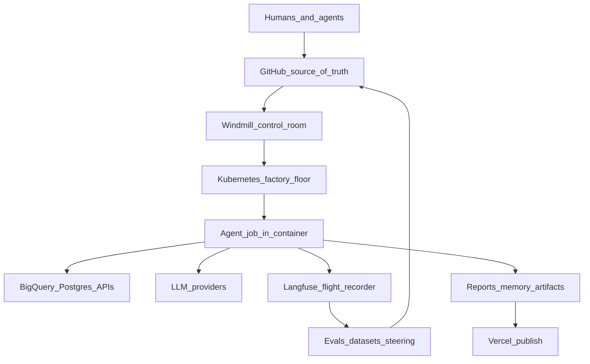
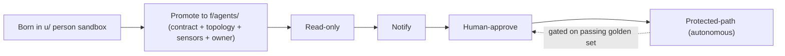

# 09 — Agent Factory Overview

> **Canonical source**: the Touchstone [Agent Factory Overview](https://svcapital.notion.site/Touchstone-Agent-Factory-Overview-398231dbcd70802c8dbfe327290e480f) in Notion.
> **This file is a rendering mirror, not a second source of truth.** It exists so the
> doc can be published to the Operating Models section of ceosystem.io alongside
> [`08_how_we_build.md`](08_how_we_build.md). When the Notion page changes, re-sync this file and
> re-render. Where the two disagree, **Notion wins.**
>
> **Mirrored**: 2026-07-28 · **Doc date**: 2026-07-09 · **Owner**: CEO + CTO
>
> **Relationship to [`08_how_we_build.md`](08_how_we_build.md)**: `08` governs *what we choose to build and
> when we stop*, across all three lanes. This doc governs *how a commercializable
> agent is built, run, and improved* — the build-and-certify path for the Agentic
> lane only. Conventional Platform work does not pass through it.

**Status:**

- Agent Factory — Answered (doc on what we actually built) → Agent Factory — Answered (what we actually built)
- Touchstone reference. Companion to `agentic_company_os_strawman_v1.md`. **Date:** 2026-07-09

**Audience:** The whole team — builders, eng/CTO, GTM, CS, and leadership.

**What it is for:** One durable picture of how SuperCat builds, runs, and improves agents — the "Agent Factory." It turns the decided organizing model (the strawman's Item 5 and Item 6) into an operating reference, and shows the concrete tech stack — GitHub, Windmill, Kubernetes, Langfuse, our data warehouse, Vercel — that makes it real.

> This doc treats the strawman's **Item 5** (layer × lane × topology) and **Item 6** (one shared quality bar + topology templates) as **decided**. It does not re-open those debates. It *implements* them.

---

## 1. What this is / who it's for

SuperCat now runs enough agents — the CEO System, the customer-intelligence work, GTM automation, agent research — that "each person builds their own clever scripts" no longer scales. The Agent Factory is the answer to a simple question: **how do we build the next agent the same disciplined way every time, run it reliably, and know whether it's any good?**

Read this if you want the one-page mental model, then the stack, then how it all fits. Three audiences, three entry points:

- **Leadership / non-technical:** §2 (the factory in one page), §3 (how it's organized), §11 (principles).
- **Builders / GTM / CS:** §6 (the quality bar), §9–10 (lifecycle + how to stand up a new agent).
- **Eng / CTO:** §4–5 (stack + floor), §8 (observability + evals), the appendices.

The **north star**: every agent is *versioned in GitHub, scheduled by Windmill, executed on Kubernetes, observed by Langfuse, evaluated against a shared quality bar, and improved through pull requests* — with every run traceable to code, prompt, data, model, and output.

---

## 2. The factory in one page

A factory is not "more automation." It's **variety reduction**: we commit to a small number of repeatable patterns so that quality can be engineered once and reused, instead of hand-built per agent. Everything below hangs off that idea.



The factory analogy, mapped to our tools:

| Factory concept | SuperCat equivalent |
|---|---|
| Blueprint / official instructions | GitHub repo (code, prompts, templates, docs) |
| Change approval | Branch + pull request |
| Production line / control room | Windmill workflow + schedule |
| Factory floor | Kubernetes cluster |
| Standardized workstation | Container (the agent's packaged environment) |
| Raw materials | Business data (BigQuery, Postgres, APIs) |
| Operator instructions | Prompts |
| Quality inspection + flight recorder | Langfuse (evals + traces) |
| Shipping dock | Vercel / GitHub / Slack |
| Continuous-improvement loop | Traces → evals → prompt/code change → PR → deploy |

The one sentence to remember: **GitHub is the versioned truth, Windmill is the control room, Kubernetes is the reliable floor, Langfuse is the flight recorder and QA lab, and the data warehouse holds the raw materials — no single system does two of those jobs.**

---

## 3. The three organizing dimensions (decided)

An agent has three independent properties. Keeping them separate is what makes the factory legible. (This is the strawman's Item 5, restated as reference.)

### 3.1 Structure = a layered harness stack (L0–L4)

The tree is organized by **what is shared vs. what is agent-specific**, not by team or domain.

| Layer | What lives here | Shared? |
|---|---|---|
| **L0 Substrate** | Truth/provenance spine, the data plane (Postgres + BigQuery + canonical query library), platform primitives (ingress verification, shared clients, logging, error tables), credentials | Shared by all |
| **L1 Context** | Foundation + commercial context (ICP, market, who-we-serve), behind the lane firewall | Shared, firewalled |
| **L2 Standards** | The shared quality bar: epistemic constitution, multi-agent guardrails, output-contract sensors, eval harness, drift detection | Shared by all |
| **L3 Agents** | Each agent: `flows + scripts + config + guides + sensors + README`, tagged with its lane + topology | Agent-specific |
| **L4 Outputs** | Rendered artifacts, tagged by lane; internal and customer outputs physically separate | Agent-specific |

The plain-English test that decides where anything goes: **if a second agent would reuse it, it belongs in L0–L2; if it only makes sense for one agent, it belongs in that agent's L3.**

### 3.2 Lane = a firewall, not a folder

Every agent and every context asset is tagged `Internal-Ops`, `Customer-Product`, or `Shared`, and carries a **bidirectional firewall contract**. Lane is a governance property woven through L1 and L3 — *not* a top-level folder — because our most valuable assets are genuinely dual-lane and a lane-first tree would shatter the shared substrate.

- **Inbound firewall** (which lane an idea is even allowed into): the `agent_research` operator test — *is the day-to-day operator a persona at the customer's company, and would it run on the customer's instance?* — plus Phase A/B data separation.
- **Outbound firewall** (what must never leak): internal-only data (named churn, raw call transcripts, internal financials, cross-tenant data) must never surface in a customer-facing product.

### 3.3 Topology = a harness template (the factory itself)

We commit to **four topologies**, each shipping a default bundle of guides and sensors. This is the variety reduction that makes a comprehensive harness achievable:

1. **Scheduled synthesis report** — the CEO System pattern (freshness gate, content-floor sensor, contract/placeholder sensor, steering loop).
2. **Operator skill** — the Insightful Product / copilot pattern (provenance gates, surface-detection + fallback matrix, provenance appendix).
3. **Outbound automation** — the GTM nurture pattern (no-hallucination validator, blank-content pause, all-or-nothing enrollment, dry-run).
4. **MCP tool-server** — the supercat-cs-tools pattern (signature verification, read-first posture, auth boundary).

A new agent picks a lane, picks a topology, and inherits that topology's harness bundle. That is the factory in one move.

---

## 4. Tech stack — who owns what

The single most important governance rule in the whole factory: **do not let two systems quietly become the source of truth for the same thing.** Each system has exactly one job.

| Layer | Tool | Its one job |
|---|---|---|
| Source of truth | **GitHub** | Versioned code, prompts, templates, renderers, validators, workflow definitions, docs; reports + editorial memory (initially) |
| Change control | **Branches / PRs** | Propose and review changes safely before they reach production |
| Control room | **Windmill** | *When* and *how* a workflow runs: schedules, steps, parameters, logs, retries, manual reruns, permissions |
| Execution floor | **Kubernetes** | *Where* it runs and *staying* running: repeatable container environments, restarts, resources, secret injection |
| AI observability + QA | **Langfuse** | Traces every AI step, stores prompt versions, scores output quality, tracks cost/latency, runs evals |
| Business data | **BigQuery / Postgres / APIs** | The real data the agent reasons over |
| Secrets | **Windmill / K8s secret store** | Keys and tokens — never in GitHub |
| Publishing | **Vercel** | Renders finished web-facing output (e.g. ceosystem.io) |

What each system *answers*, in its own words:

- **GitHub:** What's the official version? What changed? Who changed it? Can we revert?
- **Windmill:** When should this run? What steps? Did each succeed? What were the logs? Who triggered it?
- **Kubernetes:** Where should this run? Is it running? Did it fail? Should it restart? Does it have enough CPU/memory and access to secrets?
- **Langfuse:** Which prompt/model/context produced this output? How much did it cost? How long did it take? Was it any good?

**Migration-phase rule for prompts:** GitHub is canonical for prompts; Langfuse *observes* prompt performance. We only consider moving prompt *serving* into Langfuse after the GitHub-first migration is stable (see §8). We are already fighting source-of-truth confusion during the cutover — we will not introduce a second prompt source of truth mid-flight.

---

## 5. How the factory floor works (plain English)

You mostly don't need to think about Kubernetes — that's the point of it. But the team should share one accurate mental model so conversations with the CTO are precise. Deep definitions are in Appendix A; here is the floor in one picture.

**Kubernetes is the orchestration layer.** It is not the cloud, not a database, not GitHub. It takes a pool of machines and decides where software runs, keeps it running, restarts it on failure, and connects it to compute, storage, secrets, and networking.

The nesting, outermost to innermost:

```
Kubernetes cluster            ← the whole managed fleet of machines
  └── worker node             ← one machine in the fleet
        └── Pod               ← the smallest unit K8s schedules onto a node
              └── container   ← the agent's packaged, repeatable environment
                    └── Windmill worker + the agent job
```

Two things both called "worker" — worth disambiguating once:

- **Kubernetes worker node** = a *machine* in the cluster.
- **Windmill worker** = a *job executor* that runs inside a Pod, which is scheduled onto a K8s worker node.

So "private Windmill running on Kubernetes" means: the cluster runs Windmill; Windmill runs our scheduled workflows; an agent (like the CEO System) becomes one of those workflows, executed in a container on a worker node.

**Why this removes brittleness.** The old CEO System runtime asked a fragile question every morning: *is the Mac mini awake, synced via iCloud, on the right path, with the right local Python and secrets?* The factory replaces it with a durable one: *did the scheduled workflow run the approved GitHub version in the standard container environment?* Kubernetes gives us repeatable runtimes, centralized execution, restarts/retries, secret injection, and observability — and it ends the dependency on one physical machine.

Kubernetes has its own scheduler (a **CronJob**), but we let **Windmill** own scheduling because it gives humans a real control room — schedules, parameters, logs, retries, manual reruns, permissions, visibility — rather than a raw infrastructure cron.

---

## 6. Harness overview — guides, sensors, and the quality bar

The harness is everything around the model. **Agent = Model + Harness.** The model is a commodity; the harness is the engineering, and it's where all our leverage is. The harness has two halves (the strawman's Item 2 vocabulary, used everywhere):

- **Guides (feedforward)** steer the agent *before* it acts: context, rules, templates, schemas.
- **Sensors (feedback)** catch problems *after* it acts: validators, gates, LLM-as-judge review.

Every control is either **computational** (deterministic, cheap, runs every time — a SQL gate, a schema check, a placeholder linter) or **inferential** (LLM judgment — richer, but non-deterministic and expensive). We always know which one we're relying on. And we **keep quality left**: the cheapest computational checks run before anything is emitted; expensive inferential review runs last.

### The shared quality bar (one bar, both lanes)

There is **one** quality bar every production agent clears, internal or customer-facing. Only *intake* differs by lane (see below). The bar is the set of guides and sensors that live at L2:

| L2 element | Guide / Sensor | Comp. / Infer. | Status today |
|---|---|---|---|
| Epistemic constitution (confidence tiers, capture ≠ attribution, "lowest input wins or suppress") | Guide + Sensor | both | Adopt as-is |
| Multi-agent law (surface ownership, cite-don't-requery, number gate, delta discipline) | Guide | inferential | Adopt, generalize |
| Output-contract checks (placeholder linter, JSON-section gate, HTML validators) | Sensor | computational | Adopt, make blocking |
| Outbound firewall (internal-only entity/figure denylist) | Sensor | comp. + infer. | Build |
| Eval harness (golden sets, thresholds, regression runner) | Sensor | computational | **Missing — build (Langfuse, §8)** |
| Drift detection (semantic/number drift over time) | Sensor | inferential | **Partial — build (steering loop, §8)** |

We are strong on guides and weak on **sensors that block**. The two missing rows are the feedback half of harness engineering — and §8 shows where they live.

### Intake differs by lane (not the quality bar)

Deciding *whether to build* an agent is separate from the quality bar every agent clears once it exists:

| | Internal-ops lane | Customer-product lane |
|---|---|---|
| Question | "Do we have a real operating need?" | "Should we build and *sell* this?" |
| Gate | Named operating need + named owner + a fresh data source | 8-dim viability template + Opportunity × Viability scoring + WTP/tier |
| Firewall | — | Phase A/B + operator test |

The CEO System never passed opportunity scoring — it existed because we needed it. Forcing internal agents through a product-commercialization gate would be a category error.

---

## 7. Worked example — the CEO System poured into the factory

The model is easiest to trust when you see our most mature stack decomposed into it. These are real components, re-homed into their layer:

| Layer | The CEO System's actual pieces |
|---|---|
| **L0** `f/platform/` | BigQuery + Postgres access and the `bigquery_query` tool; `lib/hubspot_client.py`, `lib/fathom_api_client.py`, `lib/helpscout_snapshot.py`; the Anthropic key + Slack tokens (one consolidated secret); `lib/artifact_freshness.py` + `association_freshness.py` (the "is the data fresh enough to run?" gate); the notifier + run logs |
| **L1** `f/context/` | `foundation/CEO_SYSTEM_CONTEXT.md` (already read at runtime by 7 prompts); `customer_org_shortnames.csv`. Tagged `Shared` — the same context legitimately feeds product agents |
| **L2** `f/standards/` | `CEO_SYSTEM_GUARDRAILS.md`; output-contract sensors `require_json_sections()`, `smoke_test_renderers.py`, `validate_*_html.py`; brand tokens; the steering loop `editorial_memory.py`. Gap: no golden-set eval runner yet |
| **L3** `f/agents/ceo_system/` | `orchestrator/` (`scheduler.py`, `runner.py`, the `config.yaml` DAG, `tools.py`); the 14 `prompts/*.md`; the per-artifact `render_html_wholesale.py` renderers; `pipelines/` (deals, sales_calls, support, voc). Header: `lane: internal_ops`, `topology: scheduled agent-loop` |
| **L4 outputs** | `reports/ceo_system/<artifact>_<date>.{md,html}` — all `internal_ops` lane |

The MCPs, freshness gate, guardrails doc, and foundation context all pass the "a second agent would reuse it" test — which is exactly why the CEO System shouldn't own them privately. When the rep copilot gets built, it reuses L0–L2 unchanged and only adds its own L3.

**End-to-end, a CEO System run in the factory:**

```
Branch / PR  →  GitHub main
     ↓
Windmill: "Run CEO System Daily" (schedule)
     ↓
Kubernetes worker executes the containerized agent
     ↓
orchestrator: fetch data → assemble context → call LLMs → render md/HTML → validate → deploy → commit reports/memory
     ↓        (Langfuse traces every step: prompt version, model, cost, latency, output)
Vercel deploy  +  Slack run summary
```

---

## 8. The improvement loop (Langfuse + steering + PRs)

Langfuse fills the gap between "we run AI workflows" and "we can understand, evaluate, and improve them." It is the concrete home of Item 6's two missing sensor rows — the eval harness and drift detection. It is **not** GitHub, not the model, not the data warehouse; it observes and measures the AI factory.

### What we trace (three levels)

- **Whole run** — one top-level trace per agent run. Metadata: `run_date`, `environment`, `git_commit_sha`, `git_branch`, `windmill_run_id`, trigger, model, total cost, total latency, success/failure, deployed URL. *Answers: what happened in the 6 AM run?*
- **Artifact** — one span per generated artifact (daily memo, wholesale report, scorecard, retro…). Metadata: `artifact_name`, `prompt_version`, `renderer_version`, input sources, validation result, deploy status. *Answers: which report was weak or broken, and why?*
- **AI call / tool step** — the actual LLM calls and supporting steps (retrieval, prompt assembly, generation, render, validate, memory write). *Answers: which exact prompt/model/context produced this claim?*

### What we evaluate

Evals are tuned to the agent's job, not generic. For the CEO System, dimensions include executive usefulness, specificity, grounding, novelty, conciseness, actionability, consistency with prior memory, risk detection, formatting validity, and cost efficiency. Langfuse supports **online** evaluation on production traces and **offline** evaluation before shipping — scoring live traces, turning examples into datasets, and running experiments.

### The loop

```
Observe (traces)  →  Review (weak/costly/failed runs)  →  Convert (good & bad examples → datasets)
   →  Experiment (test new prompt/model/renderer vs dataset)  →  Evaluate (score quality, cost, latency, format)
   →  Propose (PR with Langfuse evidence)  →  Approve (human reviews diff + outputs + evals)
   →  Deploy (merge → Windmill runs approved version)  →  Learn (new traces feed the next iteration)
```

This upgrades a PR from "here are the files I changed" to "here are the files I changed, the outputs they produced, the scores, and the cost/latency impact." That is factory discipline — no material prompt change ships on vibes alone. It is also where **drift detection** lives: the same steering-loop retro that already powers `editorial_memory.py`, now backed by measured traces instead of subjective review.

### Prompt source-of-truth decision (deliberate, not accidental)

- **Now (migration phase): GitHub canonical.** The agent loads prompts from the repo; Langfuse records which version ran and how it performed; prompt changes still go through PRs.
- **Later (only once stable): consider Langfuse-served prompts** with production labels, rollbacks, and GitHub sync — for faster iteration and non-engineer collaboration. This is a future decision, made on purpose, never a drift.

---

## 9. Agent lifecycle (sandbox → production → autonomy)

If §6 is *what good looks like*, this is *how an agent earns trust and keeps it*. Promotion and autonomy are **one ladder**, not two.



- **Born** in `u/<person>/` — a true sandbox. Nothing production runs from a personal namespace.
- **Promoted** to `f/agents/<name>/` only with a declared lane + firewall contract, a topology, its default sensors wired, and a named owner — entering at low autonomy.
- **Graduates autonomy** along Read-only → Notify → Human-approve → Protected-path. It earns Protected-path *only after its golden set (the §8 eval harness) passes.* **No eval, no autonomy.**

Coherence over time is held by four more mechanisms: spec version pinning (no live `main` fetches), single canonical credentials in `f/platform/` (no plaintext secrets in git), the steering-loop retro as a company practice (rules cite the incident that birthed them), and single-owner accountability for every agent, context class, and template.

---

## 10. How a new agent gets built (the factory recipe)

The whole point of the factory is that this is a short, repeatable checklist — not a research project.

1. **Intake.** Pass the lane-appropriate gate (§6): operating-need test for internal; viability + scoring for customer-product.
2. **Declare the contract.** Lane, operator, whose-instance, value basis, `context_allowed`, `never_emit`.
3. **Pick a topology.** One of the four (§3.3). You inherit its default guides+sensors bundle for free.
4. **Build in** `u/` **sandbox.** Reuse L0 substrate, L1 context (respecting the firewall), and L2 standards. Only write the agent-specific L3.
5. **Instrument.** Wire Langfuse tracing at all three levels (§8) from day one — visibility before optimization.
6. **Evaluate.** Build a small golden set; define acceptance thresholds; run offline evals.
7. **Promote via PR.** Include Langfuse evidence (traces, prompt versions, scores, cost/latency). Human approves diff + outputs + evals.
8. **Run + graduate.** Windmill schedules it on Kubernetes; autonomy graduates only as evals pass.

---

## 11. Operating principles (the short list)

1. **Harness over model.** Our leverage is the guides, sensors, and evals around the model — never the model choice.
2. **One shared quality bar, regardless of lane.** Only intake differs by lane.
3. **Lane is a firewall, not a folder.** Internal-only data never leaves for customer-facing product.
4. **Trust is earned by evals.** No golden set, no Protected-path.
5. **Keep quality left.** Cheapest deterministic checks first; expensive inferential judgment last.
6. **`f/` is the company OS; `u/` is the sandbox.** Production never runs from a personal namespace.
7. **One system, one job.** Never let two systems quietly become the source of truth for the same thing.
8. **Rules cite their scar.** Add governance only in response to a specific failure; fix the harness, not the output.

---

## 12. Near-term build sequence

The factory arrives in waves. The full CEO System migration detail lives in its own migration plan; this is the near-term spine.

| Horizon | Move | Proves |
|---|---|---|
| **Reconcile** | Make GitHub authoritative for the CEO System (retire iCloud/local-runtime brittleness); paths become repo-root-relative | The source of truth is real, not stale |
| **Stand up the shared layers** | `f/platform` (canonical credentials, ingress, data plane) + `f/standards` (adopt guides + output-contract sensors, make them blocking) | The shared substrate + the quality bar |
| **Migrate the flagship** | CEO System → `f/agents/ceo_system` on the scheduled-report topology, run by Windmill on Kubernetes | Topology template #1 with a real agent on it |
| **Add the feedback half** | Wire Langfuse tracing → build the first golden-set eval (rep copilot) → wire the outbound firewall denylist sensor | The missing eval + drift sensors; the product lane |

Kubernetes does not magically fix bad paths, stale GitHub, or missing secrets — reconciliation into GitHub comes first, always.

---

## Appendix A — Glossary

- **Cloud computing** — rented/managed infrastructure: compute, storage, databases, networking, secrets, and orchestration.
- **Kubernetes (K8s)** — the orchestration layer that decides where software runs, keeps it running, and connects it to resources. Not the cloud, a database, or GitHub.
- **Cluster** — the whole managed Kubernetes environment: a control plane (the dispatcher) plus worker nodes (the machines that do the work).
- **Control plane** — the "brain": decides what runs where and what to do on failure.
- **Worker node** — a machine (often a cloud VM) that Kubernetes assigns work to.
- **Pod** — the smallest unit Kubernetes schedules; one or more containers with shared network and storage.
- **Container** — a packaged, portable software environment (code + runtime + libraries + config) that runs consistently across machines.
- **PersistentVolume / PersistentVolumeClaim** — durable storage a Pod can attach to; a claim requests size and access mode, like a Pod requests compute.
- **CronJob** — Kubernetes' built-in recurring scheduled job. We prefer Windmill schedules for the human-facing control room.
- **Windmill worker** — a job executor that runs inside a Pod (distinct from a K8s worker node).
- **Langfuse** — an AI observability + evaluation platform: traces, prompt management, evals, datasets, and metrics.

---

## Appendix B — Responsibility matrix (no dual sources of truth)

| Responsibility | Owner |
|---|---|
| Official code / renderers / templates / docs | GitHub |
| Prompt source of truth (migration phase) | GitHub |
| Prompt observability + future prompt ops | Langfuse |
| Scheduled runs | Windmill |
| Reliable execution | Kubernetes |
| AI traces + model-call history | Langfuse |
| Evaluation scores + experiment datasets | Langfuse |
| Business / source data | BigQuery, Postgres, APIs |
| Secrets | Windmill / Kubernetes secret store — never GitHub |
| Published site | Vercel |
| Reports / editorial memory | GitHub initially; object storage later for large artifacts |

The rule that keeps this honest: **do not let two systems quietly become the source of truth for the same thing.**

---

## Appendix C — Open questions for the CTO

The two that matter most: **what can we safely log?** and **where is the prompt source of truth?** The rest:

1. Is Langfuse self-hosted in our infrastructure, or Langfuse Cloud? If self-hosted, on the same Kubernetes cluster as Windmill?
2. Are its backing stores (Postgres, ClickHouse, Redis/Valkey, blob storage) already provisioned?
3. Data-retention policy for traces, prompts, inputs, outputs, scores?
4. Are we allowed to log full CEO-system prompts and outputs, or do we need redaction/sampling?
5. Can traces include `git_commit_sha`, `windmill_run_id`, and artifact name?
6. Do we want separate staging and production Langfuse projects?
7. Can Windmill/Kubernetes reach the same data sources and deploy targets the Mac mini currently can?
8. What are the initial eval metrics for CEO report quality?

---

*v1 touchstone. Companion to the Agentic Company OS strawman. Refine as the factory is built.*
