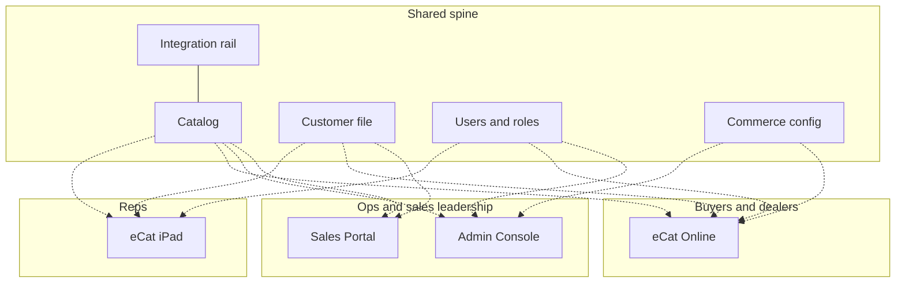

# SuperCat Platform Anatomy — Current State

> **What this is**: Validated point-of-view, locked outline, and visual brief for a company-wide **Platform Anatomy** map of SuperCat **as it ships today**.
>
> **What this is not**: A roadmap, device-migration plan, Insights product map, or agent surface map. The **tension** view names the conventions that constrain the current shape. The **shape** view (added 2026-08-05) re-parents the same capabilities as persona → job → runtime — a proposed target, still with no dates and no new capabilities invented.
>
> **Date**: 2026-08-04 · **Updated**: 2026-08-05 (tension + shape views) · **Owner**: CEO · **Status**: Outline locked · **rendered** for stress-testing, pending live stakeholder stamp
>
> **Rendered artifact**: [`reports/platform/platform_anatomy_current_state_2026-08-04.html`](../reports/platform/platform_anatomy_current_state_2026-08-04.html) — `?view=radial|schematic|matrix|tension|shape`
>
> **Companion to**: [`01_what_we_do.md`](01_what_we_do.md) (surface doctrine) · deep inventory in [`skills/monetization_refresh_2026/11_synthesis/2026-01-28__product_capability_map__m3_input__v1.md`](../skills/monetization_refresh_2026/11_synthesis/2026-01-28__product_capability_map__m3_input__v1.md)

---

## 1. Validated current-state POV

These bullets must remain true for the map to be honest. Sources reconciled: capability map (Jan 2026), [`01`](01_what_we_do.md), [`02`](02_who_we_serve.md), [`03`](03_how_we_make_money.md), [`CEO_SYSTEM_CONTEXT.md`](CEO_SYSTEM_CONTEXT.md); adoption refreshed via Postgres 2026-08-04.

1. **SuperCat is five connected surfaces on one spine — not five separate products.** Surfaces share one catalog, one customer file, one user file, and one commerce configuration model.
2. **Three actor bands explain who the surfaces are for:** manufacturer reps; manufacturer buyers/dealers; manufacturer ops and sales leadership. Primary actor ownership is how the map is organized.
3. **eCat iPad is the install-base center of gravity** — a **rep selling instrument** (browse → configure → present → write), fully offline-capable. It is not the manufacturer's (or buyer's) order system of record.
4. **Selling instrument ≠ order consummation.** An iPad session may submit into SuperCat or produce intent consummated in ERP / phone / EDI / market / the account's own ecommerce. Absence of SuperCat-submitted volume is not "failed adoption."
5. **eCat Online is one buyer-facing surface with three modes** — Catalog, B2B Cart, Closed Site — not three peer products equal to iPad. Same catalog spine as the rep sees on iPad.
6. **Sales Portal is where sales leadership and CS live** (dashboards, customers/orders/invoices, reports). It can be embedded in iPad via WebView; that is an access path, not a sixth surface.
7. **Admin Console is the manufacturer's back-office** (catalog/taxonomy, users, orders/customers, library, config for gated capabilities). Included with the iPad relationship; not a separate commercial "app" identity.
8. **Data integration is a spine rail, not a user-facing app** — FTP import, order export/ERP, address verification, external API, customer-specific connectors.
9. **CPQ / configurable products + kits are a capability cluster, not a surface.** They appear on iPad and on eOL where enabled; depth is a differentiator, not a sixth bubble.
10. **Packaging is in transition, but packaging is not the map's spine.** Modular SKUs still dominate billing; T1/T2/T3 plans exist in production for a handful of orgs. Mention as a footnote only.
11. **Adoption gravity is unchanged in shape since the Jan 2026 audit** — iPad first; Catalog / Closed Site / Portal / Cart compose around it. Absolute counts drift; the ladder does not. (See §2.)
12. **Insights Layer and agentic work are not shipping product surfaces today.** Insights is queryable infrastructure / CS-operable intelligence; agents are an operating-model lane. Both belong only in a one-line footer.

### Conflicts resolved

| Tension | Resolution for this map |
|---|---|
| Foundation sometimes lists Catalog / Cart / Closed Site as peer "products" in pricing tables | Map treats them as **modes of eCat Online** under the buyer actor |
| Portal sometimes framed as T2 vs T3 in packaging docs | Irrelevant to current-state anatomy — Portal is a surface with ~36 active plan orgs |
| Capability map lists "Surface 5: Data Integration" as a surface | Map shows it as **spine extension**, not an actor-owned app |
| Insights appears in foundation mermaid under "intel" | Demoted to **footer footnote** — not packaged as a peer surface today |
| Q425 n≈110 vs capability audit n=118 vs Postgres mobile_enabled=123 | Counts depend on inclusion rule; map uses **subscription-plan org counts (2026-08-04)** labeled as-of, and does not claim a single canonical customer census |

---

## 2. Freshness spot-check (2026-08-04)

Narrow check only — does not re-audit flags or unused features.

### Active subscription plans (orgs with `status = 'active'`, end_date null or ≥ today)

| Plan / surface signal | Orgs (2026-08-04) | Jan 2026 capability map |
|---|---:|---:|
| eCat iPad | 92 | 88 |
| eCat (iPad) Service with CPQ | 16 | 16 |
| eCat Online Service (Catalog) | 49 | 48 |
| eCat Online – Closed Site | 44 | 43 |
| eCat Online – Portal | 36 | 32 |
| eCat Online – B2B Cart | 30 | 26 |
| T1 / T2 / T3 tier plans (combined) | 5 | — (not yet live) |

Other context: `organizations.mobile_enabled = true` → **123**; orgs with any active subscription → **115**; mobile sites → **102** across **98** orgs.

### eOL structure

Still correctly described as **Catalog + Cart + Closed Site** under one buyer-facing web product. Mobile-site flags remain the operational enablement layer (`enable_online_catalog`, `enable_online_ordering`, `enable_sales_portal`, auth flags). Flag counts exceed paid-plan counts (expected — flags and billing are not 1:1).

### New shipping UI surface?

**None.** No Insights or agent controllers appear as customer-facing product surfaces. `Managed Integration Hosting` (3 orgs) is a commercial SKU on the integration rail, not a new app. T1/T2/T3 plan rows confirm packaging transition without changing anatomy.

---

## 3. Locked outline — Platform Anatomy map

### Visualization form

**Platform Anatomy** — two diagram techniques from one model (see §5). Outline below is the content model; geometry lives in the render.

Read as: Shared spine → Actor bands → Surfaces → Capability clusters. Footer footnotes only.



### A. Shared spine (top band — five nodes)

| Node | Label copy (short) | What it holds |
|---|---|---|
| Catalog | One catalog | Products, options/kits, images, inventory |
| Customer file | One customer file | Bill-tos, ship-tos, contract pricing |
| Users & roles | One user file | Reps, admins, buyer accounts |
| Commerce config | One config model | Price levels, mobile sites, enrollment rules |
| Integration rail | Integration rail | FTP import, order export / ERP, address verification, API |

### B. Actor → surface → capability clusters

| Actor band | Surface | How to draw | Capability clusters (3–6 each) |
|---|---|---|---|
| **Manufacturer reps** | **eCat iPad** | Primary large node; native iPad app | (1) Offline catalog browse & present (2) Customer context (3) Order write & submit (4) Documents / library (5) Configurable products & kits *where enabled* |
| **Manufacturer buyers / dealers** | **eCat Online** | One parent node with **three labeled modes**: Catalog · Cart · Closed Site | (1) Catalog browse & search (2) Authenticated / closed access & enrollment (3) B2B cart & checkout (4) Projects & favorites (5) Configurable products & kits *where enabled* |
| **Manufacturer ops / catalog admin** | **Admin Console** | Back-office node | (1) Catalog & taxonomy ops (2) Users & permissions (3) Orders & customers (4) Library & notices (5) Gated-capability configuration |
| **Sales leadership / CS** | **Sales Portal** | Analytics / ops node | (1) Performance dashboards (2) Customers, orders, invoices (3) Reports & export |

**Annotations (not nodes):**

- Portal embeddable in iPad via WebView — small callout on the Portal↔iPad edge.
- Integration rail sits on the spine, not in an actor band.

### B1. Capability layer (third tier — expressed in the render)

Each cluster carries 4–8 named capabilities so the map can be stress-tested at working altitude. Full list lives in the rendered HTML; the rules are:

- **Named capabilities, not flags.** "Contract pricing" — never `contract_pricing_enabled`.
- **A `◦` marker** denotes *not universal today* (gated, add-on, or data-dependent). One legend line explains it; no per-item gate mechanics.
- **Three detail levels** in the render — `surfaces` (board / all-hands), `clusters` (default, the alignment altitude), `capabilities` (product / CS working sessions). Deep-linkable via `?detail=`.
- Capability chips are **grouping evidence**, not the inventory. The [capability map](../skills/monetization_refresh_2026/11_synthesis/2026-01-28__product_capability_map__m3_input__v1.md) remains the exhaustive source.

### C. Cross-cutting callouts (edge labels or thin strip — not branches)

1. Same commercial dataset across every surface.
2. Selling instrument ≠ order system of record.
3. iPad remains adoption center of gravity; eOL and Portal compose around it.
4. Packaging footnote: modular SKUs still primary in market; T1/T2/T3 stamped and beginning to appear in billing.

### D. Footer footnotes (one line each — do not expand)

- **Insights Layer** — queryable / CS-operable intelligence; not a packaged peer surface today.
- **Agentic work** — operating-model lane (`08` / `09`); not a product surface on this map.

### E. Explicit non-nodes

Do not draw: Insights as a peer surface; agent product line; phone / Android / PWA / “rep on web” runtime strategy; Now / Next / Later horizons; competitor comparison; individual org flags or allowlists; unused features (copy order, RMA, etc.).

**Scope amendment (2026-08-05).** The exclusions above govern the three **current-state** views and still hold there. The **tension** view is deliberately outside that fence — it was added to seed exploration of a new platform shape, so it does name runtime as an axis and does mark “rep on web desktop” as an open gap. It still draws no roadmap, no horizons, and no target architecture: it describes what is true today and what today's conventions prevent from varying. Keep the fence when someone is being oriented; cross it only when the conversation is explicitly about the next shape.

**Scope amendment (2026-08-05, shape).** The **shape** view goes one step further: it re-parents the same ~101 capabilities as persona → job → runtime and marks consolidations and missing seats. It is still not a roadmap (no dates, no Now/Next/Later) and invents no new capabilities — the build **fails** if any current capability is unclaimed. The UI labels it under **Exploring** with a `target shape · proposed` chip so it cannot be mistaken for stamped current state.

---

## 4. Desk pressure-test

Pass criteria from the plan: narrate in under two minutes without a spreadsheet; no one should need the roadmap to understand the picture.

### Two-minute narration (canonical)

> SuperCat is one commercial dataset — catalog, customers, users, config — exposed through four user-facing surfaces and an integration rail. Reps sell on **eCat iPad**, offline. Buyers use **eCat Online** (catalog, optional cart, optional closed/auth access). Ops run the business in **Admin**. Sales leadership and CS see performance in the **Sales Portal**. Configurable products are a deep capability on the selling and buying surfaces, not a separate product. Packaging is moving from module stacks to tiers, but that doesn’t change what the platform *is*.

### Nodes killed or demoted

| Candidate | Decision | Why |
|---|---|---|
| “Light analytics via embedded Portal” as an iPad **cluster** | **Demoted** to edge annotation | Secondary access path; keeping it as a cluster implies a sixth capability domain on iPad |
| Insights Layer under “intel” (as in `01` mermaid) | **Footer only** | Early days; expands into delivery-surface debate |
| Agentic / Agent Factory | **Footer only** | Operating model, not shipping platform anatomy |
| Device / runtime layer (native vs web) | **Excluded** from the three current-state views; **promoted to an axis** in the tension view (2026-08-05) | Dilutes current-state focus, but it is the whole subject once the conversation turns to the next shape |
| Managed Integration Hosting as a surface | **Excluded** | SKU on the integration rail |
| Per-mode eOL as three peer bubbles equal to iPad | **Rejected** | Violates buyer-band nesting rule; inflates product count |
| Full M3 capability rows | **Excluded** | Wrong altitude; inventory lives in the capability map |

### Remaining risk for live stamp

Desk test cannot substitute for a 15-minute walkthrough with one product/eng voice and one CS/solutions voice. Use §3 outline + §4 narration; kill any node that triggers “but next we’ll…”.

---

## 5. Visual brief (rendered)

### Artifact

**Rendered:** [`reports/platform/platform_anatomy_current_state_2026-08-04.html`](../reports/platform/platform_anatomy_current_state_2026-08-04.html)

**Source of truth (model):** [`scripts/platform_anatomy/anatomy_model.yaml`](../scripts/platform_anatomy/anatomy_model.yaml)

**Builder:** [`scripts/platform_anatomy/build_platform_anatomy.py`](../scripts/platform_anatomy/build_platform_anatomy.py)

```bash
python3 scripts/platform_anatomy/build_platform_anatomy.py
```

Deep links: `?view=radial|schematic|matrix|tension|shape` · `?detail=surfaces|clusters|capabilities` · `?order=exposure|layer`

### Five techniques (compare side by side)

The first card/table render encoded hierarchy as nested boxes — position carried no meaning. The rebuild ships **five genuine projections** of one model. The first three are current state; tension diagnoses what constrains the shape; shape proposes a re-parenting:

| Technique | Geometry that carries meaning | Answers | Best for |
|---|---|---|---|
| **Radial hierarchy** (default) | Spine at the hub (shared by construction); actors as sectors (span ∝ capability count); rings as altitude (surface → cluster → capability dots); dashed gold **chords** for cross-surface capabilities | What *is* SuperCat? | Gestalt / all-hands alignment |
| **Orthogonal bus schematic** | Spine as a horizontal bus with taps; four surfaces as equal blocks above with a uniform bottom edge; integration rail below; one dedicated horizontal **lane per shared capability** | How is it wired? | Lookup / eng-native reading |
| **Blast radius** (matrix) | Rows = change domains, columns = surfaces, cell = core / secondary / absent; a derived **plan-org exposure** bar sorts the rows | If we change this, who is affected? | Sequencing, scoping, review cost |
| **Tension** | A persona × runtime **coverage grid** (served / workaround / gap / n-a / unassessed), plus a **leverage scatter** of conventions positioned by derived constraint against stated cost to unwind, with a parity diagonal | What is holding the shape in place, and what should move first? | Diagnosing the fusion |
| **Shape** | Three-column **alluvial**: persona → job → runtime class; solid ribbons = today, dashed = target seat; job nodes carry delta + offline verdict; ledger underneath | What does the platform look like if persona, job, and runtime vary independently? | Target-shape exploration |

**Why blast radius earns a slot.** Radial and schematic both describe structure; neither ranks anything. Blast radius is the only view that answers the question that follows “what is SuperCat?” in every product conversation — and it is the view that makes the platform's most consequential fact legible: *the three widest-reaching change domains are all spine.* It also inverts a lazy assumption — cross-surface is not the same as wide. Payments spans two surfaces and reaches 6 orgs.

**Exposure derivation** (one rule, so every cell is arguable and no cell is magic): sum active subscription-plan orgs on each surface where a domain is `core`. Secondary cells contribute nothing. Where a domain lives in one eOL mode, or behind a subscription narrower than the surface, that count substitutes (shown beneath the cell). Plans overlap, so exposure compares rows against each other — it is **not** a unique-org census. Rows carrying a stated objection are marked `*` and the objection is in the panel; `blast:` in the YAML is a one-line edit, which is the point.

### The three-axis thesis (what the tension view exists to argue)

Every experience in the platform is the intersection of three independent things: **persona** (who you are), **job** (what you are doing), **runtime** (where you are). Today the platform has one word for all three — the surface name. *eCat iPad* means rep **and** order-writing **and** offline. When any one of the three varies alone, the platform produces a new surface or a workaround.

Two workarounds are already visible in the field. Sales Portal is embedded inside the iPad app's `WKWebView` with an `X-SuperCat-Request-Purpose: iPad Sales Portal` header — leader content on rep hardware, solved with an iframe rather than composition. And Linon at HPMKT Spring 2026 described building a presentation as: create a Smart List on the web, download it to an iPad, generate, send back, reformat.

The correction worth holding onto: the platform is **not** organized around device. It is organized around the **unit of sale**, and the units of sale happen to be named after devices. Persona already exists as a first-class, unified concept in data — one `User` → `OrgUser` → `user_type` chain spans reps, buyers, and admins, with a median of 8 user types per org (range 3–36). What does not exist is entitlement that speaks that language. So the target is not "persona instead of device" — it is **decoupling the three axes** so each can vary independently.

**Coverage grid.** Rows are the four real personas, columns the three runtimes. Note that personas (4) outnumber actor bands (3): Admin Console and Sales Portal serve different people, which the actor banding hides. Of 12 cells: 4 served, 1 outright gap (rep on web desktop — the Linon ask), 1 workaround (leader on tablet via the iPad WebView embed), 3 genuinely not applicable, and 3 **never assessed**. The unassessed column is a finding about us, not about the platform.

**Leverage derivation** (same discipline as exposure — one rule, arguable inputs): `constraint = 2 × (axes the convention fuses) + (documented consequences)`. Cost to unwind is a **stated 1–5 judgment** with its reasoning attached to each point; it is not derived, and the view says so. The dashed diagonal is parity — above it a convention constrains more than it costs to undo. Only two clear it (`sale-unit` and `eol-modes`), which is itself the finding: there is one obvious first move and then a lot of real work. `flag-sprawl` is typed as a **tax** rather than a convention — it fuses no axis, it multiplies the cost of moving every other one — and is drawn as a diamond.

Two honest limits on this view. The `org-grouping` tension is the least directly evidenced item; it is inferred from the absence of an intermediate entity between org and user plus a few customer workarounds, not from a schema read end to end, and it carries that caveat in its panel. And `sale-unit` sits exactly on the cost midpoint, so its position is a boundary case, not a verdict.

### The shape thesis (persona → job → runtime)

The shape view keeps the identical capability inventory and changes only the parent chain: from surface → cluster → capability to **persona → job → runtime**. Convergence on a job means reuse; a dashed ribbon means a seat the target adds. Today's surface name survives only as a `via:` bridge on each seat.

**Job layer is existing doctrine.** The sell chain `browse → configure → present → write → (often) submit` is already stamped in `01`, `02`, `07`, and `CEO_SYSTEM_CONTEXT`. The shape view extends that language across three arcs:

- **Sell** — Find, Configure, Price, Assemble, Present, Write, Pay
- **Run** — Model, Provision, Publish, Fulfil
- **Know** — Measure

**Runtime classes** (not named surfaces): offline-capable native · web · small-screen web. Named surfaces appear only as `delivered today by` annotations.

**Coverage guardrail.** Every capability in `clusters:` must be claimed by exactly one job (or listed under `parked:`). The build fails otherwise — so "a remix of existing capabilities" is machine-checked, not a promise. Current tally: **101/101 claimed**, 12 jobs, today-impls **21 → 12**.

**Delta types** (prescriptive): `consolidate` (5) · `extend` (3) · `new-seat` (0) · `keep` (4). Offline verdict (`required` / `preferred` / `unnecessary`) sits on each job — the concrete fix for "offline is a device property."

### Interaction

- **Detail levels** prune ring depth (surfaces / clusters / capabilities) in the two diagrams; in the shape view the same control remaps to Personas / Jobs / Capabilities. The control hides in the matrix and tension views.
- **Order** (exposure / layer) applies to the matrix only.
- **View toggle** is split: **Current** (Radial · Schematic · Blast radius) and **Exploring** (Tension · Shape), with a state chip that flips to `target shape · proposed` on Shape.
- **Focus panel** (slide-in) is the only place full capability text lives — click a surface, cluster, spine node, matrix row, coverage cell, scatter point, job, persona, or runtime. Capability dots at the outer ring are hoverable (`title`) and open the parent cluster’s panel.
- Focus dims unrelated branches.

### Cross-surface finding (tables had hidden this)

The model’s `shared:` list is drawn as chords (radial) and one lane each (schematic) — a current-state fact the card layout could only duplicate:

1. Configurable products & kits — iPad ↔ eOL
2. Documents / library — iPad ↔ eOL ↔ Admin
3. Credit card capture — iPad ↔ eOL
4. Favorites — iPad ↔ eOL
5. Contract pricing — iPad ↔ Admin
6. Enrollment — eOL ↔ Admin
7. Reports & export — iPad ↔ Admin ↔ Portal
8. Order lifecycle — iPad ↔ eOL ↔ Admin ↔ Portal

### Design rules (still binding)

- SuperCat v2 dark tokens + Geist; hue-per-actor (gold / clay / crim); no second palette.
- The matrix needs four *surface* hues where the diagrams need three *actor* hues. Admin and Portal are both Ops, so they take two tonal steps of the same crimson (`--sc-crim` / `--sc-crim-deep`) rather than a fourth hue. **Never add a fifth hue to solve a column-count problem.**
- No roadmap chrome. Insights / agents remain footer footnotes.
- eOL stays one surface with three modes (Catalog / Cart / Closed Site) — never three peer bubbles.
- Rebuild from the YAML; do not hand-edit the HTML.
- Uniform block heights in the schematic are load-bearing, not cosmetic: they give every shared capability its own collision-free lane. An earlier stacked-column layout put all eight shared labels on one `y` and they overprinted into noise.

### Adoption counts: use the model, not memory

Three figures are easy to get wrong and are now pinned in the model with provenance in the M3 capability map:

| Capability | Correct figure | Common error |
|---|---|---|
| CPQ / configurable products | **18 orgs** subscribed (16 bundled + 2 standalone); only **6** have `:custom: true` catalog data; **25** have kit items | Quoting 16 (the bundled tier alone), or conflating subscription with catalog readiness |
| Payments / card capture | **6 orgs** (5 Secure CC + 1 PCI), ~5% of the base | Treating it as unmeasurable — it has a number, and the number is the finding |
| eOL modes | Catalog **49** · Closed Site **44** · Cart **30** | Using the 49 surface count for Cart- or Closed-Site-only capabilities |

### Success test

A new hire, a CS lead, and an engineer can each point at the page and say “yes, that’s SuperCat today” without debating packaging fences, Insights placement, or device roadmap. Take **radial** to the all-hands, **schematic** to an engineering walkthrough, **blast radius** to sequencing and scoping, **tension** to diagnose what constrains the next shape, and **shape** to argue the re-parenting. Tension and shape share a harder success test: someone should be able to disagree with a specific cell, job, or capability ref and say exactly which input they would change.

---

## 6. Source index

| Source | Role |
|---|---|
| [`01_what_we_do.md`](01_what_we_do.md) | Stamped five-surface doctrine |
| [`02_who_we_serve.md`](02_who_we_serve.md) | Actor / selling-instrument language |
| [`03_how_we_make_money.md`](03_how_we_make_money.md) | Modular → T1/T2/T3 commercial context (footnote only) |
| Capability map (2026-01-28) | Deep inventory; cluster source material |
| Postgres `subscriptions` / `mobile_sites` / `organizations` (2026-08-04) | Adoption freshness |
| [`scripts/platform_anatomy/anatomy_model.yaml`](../scripts/platform_anatomy/anatomy_model.yaml) | Shared anatomy model driving all five views (`shape:` is the target re-parenting) |
| Capability map §Gating Taxonomy + appendices | The 123 org-level control points (25 columns · 56 JSON properties · 15 mobile-site flags · 27 code allowlists) behind the `entitlement-split` and `flag-sprawl` tensions |
| [`hpmkt_spring_2026_top_themes.md`](../hpmkt_spring_2026_top_themes.md) | Customer evidence for the rep-on-web gap (Linon) and market-speed / offline load-bearing |
| `reports/feature_menu/supercat_feature_menu_2026-01-27.md` | Code-verified sync model (38+ entity types, local SQLite) behind the `offline-device` tension |

---

## 7. Next steps

1. **Compare the five projections** — `?view=radial&detail=clusters`, `?view=schematic&detail=clusters`, `?view=matrix`, `?view=tension`, `?view=shape`. Current vs Exploring stay visually split; decide which one is the *default* on open.
2. **Stress-test structure** — at `?detail=capabilities`, click clusters and challenge groupings; confirm the eight shared chords match how the team thinks about cross-surface capabilities.
3. **Stress-test the blast-radius cells** — walk the matrix top to bottom and flip any cell you disagree with in `blast:`. The three rows marked `*` are pre-loaded with their own objection; start there. The Integration rail row is the known weak spot (its `read` cells understate real reach).
4. **Stress-test the job taxonomy** — walk `shape:` job by job. Price vs Find/Write, Write vs Pay, and Fulfil vs the integration rail are the three most likely pushbacks; each is a one-line model edit.
5. **Close the three unassessed coverage cells** — the entire *web on tablet / phone* column is marked `?`. Nobody has looked. That is the cheapest research on this page and it currently blocks any honest claim about device independence.
6. **Verify the `org-grouping` tension against Postgres** — confirm whether any entity sits between `organizations` and `org_users`. It is the one tension carrying a stated evidence caveat; either promote it or drop it.
7. **Triage the 123 control points** — classify each org flag, mobile-site flag, and code allowlist as dead / org-appropriate / should-be-persona / should-be-job. This is the precondition that sizes every other move, and `flag-sprawl` is on the chart precisely to keep it from being skipped.
8. **Live 15-minute stamp** with product/eng + CS/solutions using the §4 narration.
9. Once stamped: link the rendered anatomy from [`01_what_we_do.md`](01_what_we_do.md). *(Deployed to ceosystem.io under Projects → Platform.)*

### Known judgment calls to challenge in the stress test

| Call made | Alternative if you disagree |
|---|---|
| Radial as the default view | Make schematic or blast radius the default |
| Blast radius counts subscription orgs, not unique customers | Build a unique-org denominator first (this map deliberately refuses to) |
| CPQ weighted at 18 (subscribed) rather than 6 (has catalog data) | Weight on catalog readiness — cuts CPQ exposure to 6 and reorders the bottom |
| Documents / library filed as surface-owned despite spine-scale exposure (233) | Promote it to a spine domain |
| Admin Console + Sales Portal share the ops sector | Split into separate actor bands |
| Sector span ∝ capability count | Equal sectors (loses the “ops is wider” signal) |
| Capability leaf text only in the focus panel | Put short labels on the outer ring (risks hairball) |
| Eight shared chords | Trim or expand the `shared:` list in the model |
| Integration rail is a spine node / bus tap, not an actor surface | Pull out as a fifth column for integration-heavy accounts |
| Tension: `constraint = 2 × axes fused + consequences` | Reweight, or drop the derivation and state constraint outright as a judgment like cost |
| Tension: cost to unwind is stated, not derived | Derive it from something countable (files touched, orgs affected) — at the cost of false precision |
| Tension: four personas against three actor bands | Collapse `opsadmin` + `leader` back into one row to match the radial banding |
| Tension: three runtimes (native iPad / web desktop / web tablet-phone) | Separate device from connectivity into two axes — more honest, harder to read |
| Tension: `sale-unit` is the single highest-leverage move | Argue `eol-modes` first because it is cheapest, and bank a win before the hard ones |
| Shape: 12 jobs in three arcs (Sell / Run / Know) | Collapse Price into Find+Write; merge Write+Pay; drop Fulfil into the integration rail |
| Shape: Price is a first-class job | Treat pricing as an attribute of Find and Write |
| Shape: Write and Pay are separate | Merge into one submit job (matches the stamped chain's "(often) submit") |
| Shape: Fulfil is a Run-arc job | Treat it as the integration rail wearing a job costume |
| Shape: three runtime classes (native-offline / web / web-small) | Keep the four named surfaces as the third level (preserves the fusion) |
| Shape: Configure / Assemble / Pay / Publish / Provision are consolidations | Keep dual implementations and only re-parent descriptively |
| Shape: Present / Find / Write get a rep-on-web target seat | Sequence Present first (Linon); defer Write on web |
